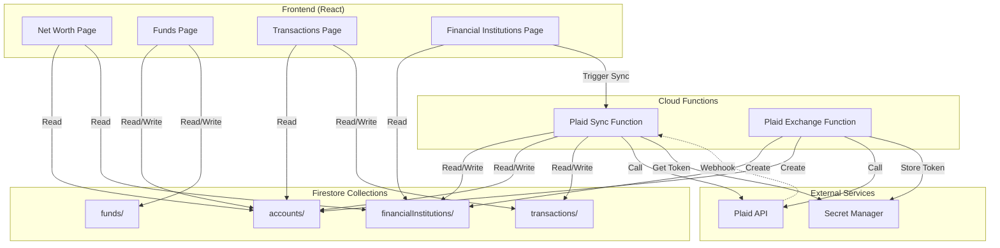
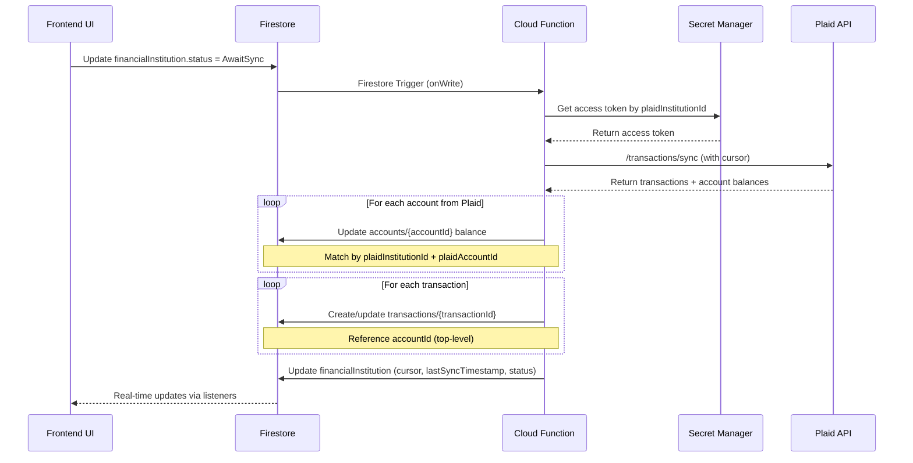
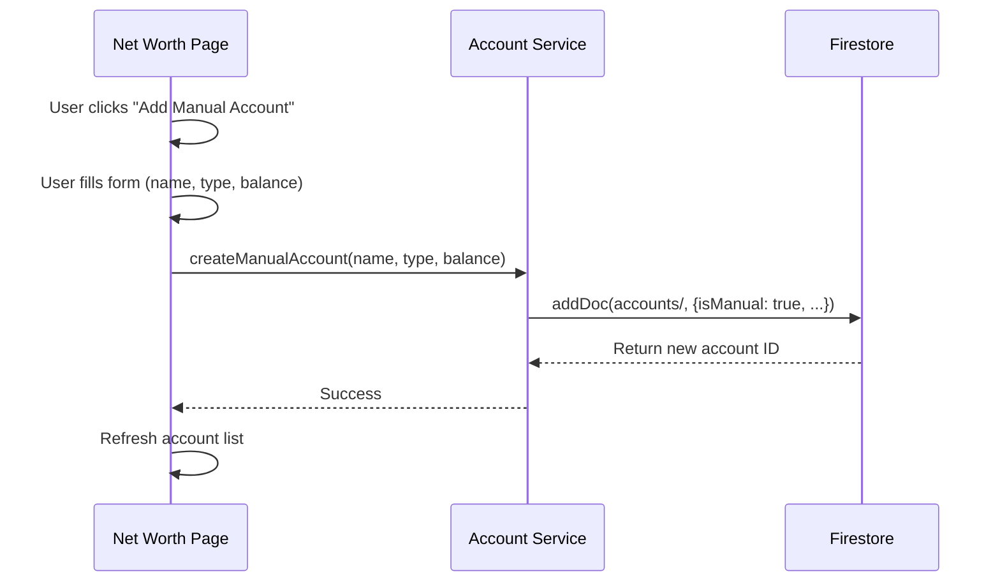

# Design Document: Net Worth Page with Normalized Accounts

## Overview

This feature introduces a consolidated Net Worth page that displays all user assets and liabilities in one place, along with a fundamental architectural change: normalizing the Firestore data structure by moving accounts from nested arrays within `financialInstitutions` documents to a top-level `accounts` collection. This normalization enables unified handling of both Plaid-linked accounts and manual accounts, supports account nicknames, flexible account type assignment, and optional goal tracking via a `targetAmount` field directly on accounts.

The current system stores accounts as nested arrays within financial institution documents, limiting flexibility and creating data duplication issues. The new architecture treats all accounts (linked or manual) as first-class entities in a top-level collection, with financial institutions serving purely as sync metadata containers. This enables a true net worth view that combines checking, savings, investment, credit cards, loans, and other account types regardless of their source. By adding `targetAmount` directly to accounts, users can set savings/investment goals without needing a separate Fund entity.

### Field Name Strategy for Migration

To simplify migration and maintain backward compatibility, this design **preserves existing field names** from the current codebase wherever possible:

**Account Interface (New Top-Level Collection)**:
- `id` - **NEW**: Firestore auto-generated doc ID (becomes the PRIMARY KEY for all references)
- `uid` - **NEW**: User ownership field
- `accountId` - **EXISTING**: Plaid's account_id (kept as-is, NOT the Firestore doc ID)
- `accountName` - **EXISTING**: Account name (kept as-is)
- `balance` - **EXISTING**: Current balance (kept as-is)
- `accountType` - **EXISTING**: Account type enum (kept as-is)
- `isManual` - **NEW**: Distinguishes manual vs linked accounts
- `institutionId` - **NEW**: Plaid Item ID (matches Transaction.institutionId for consistency)
- `institutionName` - **NEW**: Denormalized institution name
- `nickname` - **NEW**: Optional user-defined display name
- `targetAmount` - **NEW**: Optional goal amount for savings/investment tracking
- `lastSyncTimestamp` - **NEW**: Denormalized sync timestamp

**FinancialInstitution Interface (Updated)**:
- All existing fields preserved: `docId`, `uid`, `institutionId`, `institutionName`, `status`, `lastSyncTimestamp`, `cursor`, `plaidErrorCode`
- Only change: Remove `accounts` array (moved to top-level collection)

**Transaction Interface (Updated)**:
- `institutionId` - **KEPT**: Still references Plaid Item ID (for backward compatibility and filtering)
- `accountId` - **UPDATED MEANING**: Now references Account.id (Firestore doc ID) instead of Plaid's account_id
- All other fields unchanged

**Migration Impact**:
- Simpler migration: Copy nested accounts with same field names (accountId, accountName, balance, accountType)
- Add new fields: id, uid, isManual, institutionId, etc.
- Update Transaction.accountId to reference new Account.id (Firestore doc ID)
- Keep Transaction.institutionId as-is
- No need to migrate Funds - goal tracking now handled by Account.targetAmount field

## Architecture

### High-Level System Architecture




### Data Flow: Plaid Sync



### Data Flow: Manual Account Creation




## Components and Interfaces

### Component 1: Account (Top-Level Collection)

**Purpose**: Unified storage for all accounts (linked and manual) as first-class entities with optional goal tracking

**Interface**:
```typescript
export interface Account {
  id: string;                    // NEW: Firestore auto-generated doc ID (PRIMARY KEY)
  uid: string;                   // NEW: User ID
  accountId: string;             // EXISTING: Plaid's account_id (NOT Firestore doc ID)
  accountName: string;           // EXISTING: Original name from Plaid or user-entered
  nickname?: string;             // NEW: User can rename (optional)
  accountType: AccountType;      // EXISTING: checking, savings, credit, investment, loan, other
  balance: number;               // EXISTING: Current balance
  isManual: boolean;             // NEW: true = manual, false = linked

  // For linked accounts only (undefined for manual):
  institutionId?: string;        // NEW: Plaid Item ID (matches Transaction.institutionId)
  institutionName?: string;      // NEW: Denormalized for display
  lastSyncTimestamp?: number;    // NEW: Denormalized from institution for display

  // Optional goal tracking:
  targetAmount?: number;         // NEW: Optional savings/investment goal amount
}
```

**Responsibilities**:
- Store all account data (linked or manual) as top-level documents
- Support account nicknames for user customization
- Track savings/investment goals via targetAmount field
- Denormalize institution name and sync timestamp for efficient queries
- Maintain Plaid metadata for sync matching (linked accounts only)

**Validation Rules**:
- `uid` must be non-empty string
- `accountName` must be non-empty string
- `balance` must be a valid number
- `isManual` must be boolean
- If `isManual === false`, then `institutionId`, `institutionName`, and `accountId` must be defined
- If `isManual === true`, then `institutionId`, `institutionName`, and `lastSyncTimestamp` must be undefined
- `accountType` must be one of: checking, savings, credit, investment, loan, other
- If `targetAmount` is defined, it must be a positive number

**Field Name Notes**:
- `id` is the NEW Firestore document ID (primary key for queries)
- `accountId` is the EXISTING Plaid account_id (kept for backward compatibility)
- `institutionId` is the NEW field that matches Transaction.institutionId (Plaid Item ID)
- `targetAmount` replaces the need for separate Fund entities


### Component 2: FinancialInstitution (Updated - Sync Metadata Only)

**Purpose**: Store Plaid sync metadata and institution-level status (no longer stores accounts)

**Interface**:
```typescript
export interface FinancialInstitution {
  docId?: string;                         // EXISTING: Firestore document ID (optional, populated on read)
  uid: string;                            // EXISTING: User ID
  institutionId: string;                  // EXISTING: Plaid Item ID (for access token lookup)
  institutionName: string;                // EXISTING: Institution name from Plaid
  status: FinancialInstitutionStatus;     // EXISTING: Sync status
  lastSyncTimestamp: number;              // EXISTING: Last successful sync (epoch ms)
  cursor: string;                         // EXISTING: Plaid transactions sync cursor
  plaidErrorCode?: PlaidErrorCode;        // EXISTING: Error details if status is error
  // accounts array REMOVED - now top-level collection
}
```

**Responsibilities**:
- Store Plaid Item-level sync state (status, cursor, errors)
- Track last successful sync timestamp
- Provide institution name for display purposes
- Serve as trigger point for Firestore-based sync functions

**Key Changes from Current**:
- Removed `accounts: Account[]` array
- All account data now lives in top-level `accounts/` collection
- This document is purely sync metadata
- All existing field names preserved (docId, uid, institutionId, institutionName, status, lastSyncTimestamp, cursor, plaidErrorCode)


### Component 3: Transaction (Updated)

**Purpose**: Store transaction data with reference to top-level accounts

**Interface**:
```typescript
export interface Transaction {
  id: string;                    // EXISTING: Transaction ID
  uid: string;                   // EXISTING: User ID
  institutionId: string;         // EXISTING: KEEP THIS - Plaid Item ID (for backward compatibility)
  accountId: string;             // EXISTING: UPDATED MEANING - Now references Account.id (Firestore doc ID)
  name: string;                  // EXISTING: Transaction name/description
  amount: number;                // EXISTING: Transaction amount
  datetime: number;              // EXISTING: Transaction datetime as UTC epoch timestamp
  plaidCategory: string;         // EXISTING: Transaction category from plaid
  category: string;              // EXISTING: CSP category
  hidden: boolean;               // EXISTING: Whether this transaction is hidden
  splitParentId?: string;        // EXISTING: Self-reference if parent, parent ID if child
  nickname?: string;             // EXISTING: Optional: User-defined nickname
}
```

**Key Changes from Current**:
- `accountId` UPDATED MEANING: Now references top-level `accounts/{accountId}` (Account.id) instead of nested Plaid account_id
- `institutionId` KEPT: Still references Plaid Item ID for backward compatibility and filtering
- Removed `fundId` field - no longer needed since Funds are removed
- All other fields remain unchanged

**Migration Note**:
- During migration, `accountId` will be updated to reference the new top-level Account.id (Firestore doc ID)
- `institutionId` remains as-is (Plaid Item ID)

**Responsibilities**:
- Store transaction details
- Reference top-level account directly via Account.id
- Maintain institutionId for backward compatibility and institution-level filtering
- Support transaction splitting


### Component 4: CSP Savings and Investments (Updated)

**Purpose**: Track CSP (Conscious Spending Plan) savings and investment allocations that reference accounts

**Note**: The existing CSP savings and investment entities will be updated to reference accounts directly instead of funds. This simplifies the architecture by removing the intermediate Fund layer.

**Changes Required**:
- Update CSP savings to reference `accountId` (Account.id) instead of `fundId`
- Update CSP investments to reference `accountId` (Account.id) instead of `fundId`
- Remove Fund collection entirely
- Account.targetAmount provides goal tracking functionality

**Migration Impact**:
- Existing CSP savings/investments that reference funds will be updated to reference the accounts that those funds were linked to
- Manual funds without account linkage will be converted to manual accounts first, then CSP entities updated to reference those accounts


## Data Models

### Account Types Enum

```typescript
export enum AccountType {
  Checking = 'checking',
  Savings = 'savings',
  Credit = 'credit',
  Investment = 'investment',
  Loan = 'loan',
  Other = 'other',
}
```

### Account Categorization for Net Worth

**Assets** (positive contribution to net worth):
- Checking
- Savings
- Investment
- Other

**Liabilities** (negative contribution to net worth):
- Credit (credit card debt)
- Loan (mortgages, car loans, student loans, etc.)

### UI Display Model

```typescript
export interface UI_AccountWithInstitution {
  id: string;                    // Account.id (Firestore doc ID)
  accountId: string;             // Plaid account_id (for linked accounts)
  accountName: string;
  nickname?: string;
  displayName: string;           // nickname || accountName
  accountType: AccountType;
  balance: number;
  isManual: boolean;

  // For linked accounts:
  institutionId?: string;        // Plaid Item ID
  institutionName?: string;
  lastSyncTimestamp?: number;
  syncStatus?: FinancialInstitutionStatus;
  syncError?: PlaidErrorCode;

  // Goal tracking:
  targetAmount?: number;
  progressPercentage?: number;   // (balance / targetAmount) * 100
}
```


### Net Worth Calculation Model

```typescript
export interface NetWorthSummary {
  assets: {
    checking: number;
    savings: number;
    investment: number;
    other: number;
    total: number;
  };
  liabilities: {
    credit: number;
    loan: number;
    total: number;
  };
  netWorth: number;  // assets.total - liabilities.total
}
```

## Algorithmic Pseudocode

### Main Algorithm: Calculate Net Worth

```typescript
/**
 * Calculates net worth summary from all user accounts
 *
 * Preconditions:
 * - accounts is a valid array of Account objects
 * - All accounts belong to the authenticated user
 * - All account balances are valid numbers
 *
 * Postconditions:
 * - Returns NetWorthSummary with all fields populated
 * - assets.total equals sum of all asset account balances
 * - liabilities.total equals sum of all liability account balances
 * - netWorth equals assets.total - liabilities.total
 *
 * Loop Invariants:
 * - All processed accounts have been correctly categorized
 * - Running totals remain accurate throughout iteration
 */
function calculateNetWorth(accounts: Account[]): NetWorthSummary {
  // Initialize summary structure
  const summary: NetWorthSummary = {
    assets: { checking: 0, savings: 0, investment: 0, other: 0, total: 0 },
    liabilities: { credit: 0, loan: 0, total: 0 },
    netWorth: 0
  };

  // Categorize and sum accounts by type
  for (const account of accounts) {
    const balance = account.balance;

    switch (account.accountType) {
      case AccountType.Checking:
        summary.assets.checking += balance;
        break;
      case AccountType.Savings:
        summary.assets.savings += balance;
        break;
      case AccountType.Investment:
        summary.assets.investment += balance;
        break;
      case AccountType.Other:
        summary.assets.other += balance;
        break;
      case AccountType.Credit:
        summary.liabilities.credit += Math.abs(balance);
        break;
      case AccountType.Loan:
        summary.liabilities.loan += Math.abs(balance);
        break;
    }
  }

  // Calculate totals
  summary.assets.total =
    summary.assets.checking +
    summary.assets.savings +
    summary.assets.investment +
    summary.assets.other;

  summary.liabilities.total =
    summary.liabilities.credit +
    summary.liabilities.loan;

  summary.netWorth = summary.assets.total - summary.liabilities.total;

  return summary;
}
```


### Algorithm: Plaid Sync with Normalized Accounts

```typescript
/**
 * Syncs Plaid transactions and account balances to Firestore
 *
 * Preconditions:
 * - financialInstitution exists and status is AwaitSync
 * - Access token exists in Secret Manager for plaidInstitutionId
 * - Plaid API is accessible
 *
 * Postconditions:
 * - All account balances updated in accounts/ collection
 * - All new transactions created in transactions/ collection
 * - financialInstitution.cursor updated to latest
 * - financialInstitution.status set to Active or InstitutionError
 * - financialInstitution.lastSyncTimestamp updated
 *
 * Loop Invariants:
 * - All processed accounts have been updated with latest balances
 * - All processed transactions have been created/updated
 * - Cursor remains valid throughout sync
 */
async function syncPlaidInstitution(
  financialInstitution: FinancialInstitution
): Promise<void> {
  try {
    // Step 1: Get access token from Secret Manager
    const accessToken = await getSecretManagerValue(
      `plaid-access-token-${financialInstitution.plaidInstitutionId}`
    );

    // Step 2: Call Plaid /transactions/sync
    const syncResponse = await plaidClient.transactionsSync({
      access_token: accessToken,
      cursor: financialInstitution.cursor,
    });

    // Step 3: Update account balances in top-level accounts/ collection
    for (const plaidAccount of syncResponse.accounts) {
      // Find matching account by institutionId + accountId
      const accountQuery = query(
        collection(firestore, 'accounts'),
        where('uid', '==', financialInstitution.uid),
        where('institutionId', '==', financialInstitution.institutionId),
        where('accountId', '==', plaidAccount.account_id)
      );

      const accountSnapshot = await getDocs(accountQuery);

      if (accountSnapshot.empty) {
        // Create new account if not exists
        await addDoc(collection(firestore, 'accounts'), {
          uid: financialInstitution.uid,
          accountId: plaidAccount.account_id,
          accountName: plaidAccount.name,
          accountType: mapPlaidAccountType(plaidAccount.type),
          balance: plaidAccount.balances.current,
          isManual: false,
          institutionId: financialInstitution.institutionId,
          institutionName: financialInstitution.institutionName,
          lastSyncTimestamp: Date.now(),
        });
      } else {
        // Update existing account
        const accountDoc = accountSnapshot.docs[0];
        await updateDoc(doc(firestore, 'accounts', accountDoc.id), {
          balance: plaidAccount.balances.current,
          lastSyncTimestamp: Date.now(),
        });
      }
    }

    // Step 4: Process transactions
    for (const plaidTransaction of syncResponse.added) {
      // Find account by institutionId + accountId
      const accountQuery = query(
        collection(firestore, 'accounts'),
        where('uid', '==', financialInstitution.uid),
        where('institutionId', '==', financialInstitution.institutionId),
        where('accountId', '==', plaidTransaction.account_id)
      );

      const accountSnapshot = await getDocs(accountQuery);
      if (!accountSnapshot.empty) {
        const accountDocId = accountSnapshot.docs[0].id;

        // Create transaction with accountId reference (Account.id)
        await addDoc(collection(firestore, 'transactions'), {
          uid: financialInstitution.uid,
          institutionId: financialInstitution.institutionId,  // Keep for backward compatibility
          accountId: accountDocId,  // Reference to top-level Account.id (Firestore doc ID)
          name: plaidTransaction.name,
          amount: plaidTransaction.amount,
          datetime: new Date(plaidTransaction.date).getTime(),
          plaidCategory: plaidTransaction.category?.[0] || 'Uncategorized',
          category: mapToCSPCategory(plaidTransaction.category),
          hidden: false,
        });
      }
    }

    // Step 5: Update financial institution metadata
    await updateDoc(
      doc(firestore, 'financialInstitutions', financialInstitution.id),
      {
        cursor: syncResponse.next_cursor,
        lastSyncTimestamp: Date.now(),
        status: FinancialInstitutionStatus.Active,
        plaidErrorCode: null,
      }
    );

  } catch (error) {
    // Handle Plaid errors
    if (isPlaidError(error)) {
      await updateDoc(
        doc(firestore, 'financialInstitutions', financialInstitution.id),
        {
          status: FinancialInstitutionStatus.InstitutionError,
          plaidErrorCode: error.error_code,
        }
      );
    }
    throw error;
  }
}
```


## Key Functions with Formal Specifications

### Function 1: createManualAccount()

```typescript
async function createManualAccount(
  accountName: string,
  accountType: AccountType,
  initialBalance: number,
  nickname?: string
): Promise<string>
```

**Preconditions:**
- User is authenticated
- `accountName` is non-empty string
- `accountType` is valid AccountType enum value
- `initialBalance` is a valid number

**Postconditions:**
- New account document created in `accounts/` collection
- Account has `isManual: true`
- Account has no Plaid metadata fields
- Returns Firestore-generated account ID
- Account is immediately queryable by user

**Loop Invariants:** N/A (no loops)

### Function 2: updateAccountNickname()

```typescript
async function updateAccountNickname(
  accountId: string,
  nickname: string | null
): Promise<void>
```

**Preconditions:**
- User is authenticated
- Account with `accountId` exists and belongs to user
- `nickname` is either non-empty string or null (to clear)

**Postconditions:**
- Account document updated with new nickname
- If `nickname` is null, nickname field is removed from document
- No other account fields are modified

**Loop Invariants:** N/A (no loops)

### Function 3: updateManualAccountBalance()

```typescript
async function updateManualAccountBalance(
  accountId: string,
  newBalance: number
): Promise<void>
```

**Preconditions:**
- User is authenticated
- Account with `accountId` exists and belongs to user
- Account has `isManual: true`
- `newBalance` is a valid number

**Postconditions:**
- Account balance updated to `newBalance`
- No other account fields are modified
- Linked funds reflect new balance immediately

**Loop Invariants:** N/A (no loops)


### Function 4: updateAccountTargetAmount()

```typescript
async function updateAccountTargetAmount(
  accountId: string,
  targetAmount: number | null
): Promise<void>
```

**Preconditions:**
- User is authenticated
- Account with `accountId` exists and belongs to user
- If `targetAmount` is not null, it must be a positive number

**Postconditions:**
- Account's `targetAmount` field updated to new value
- If `targetAmount` is null, field is removed from document
- No other account fields are modified

**Loop Invariants:** N/A (no loops)

### Function 5: deleteManualAccount()

```typescript
async function deleteManualAccount(accountId: string): Promise<void>
```

**Preconditions:**
- User is authenticated
- Account with `accountId` exists and belongs to user
- Account has `isManual: true`
- No transactions reference this account

**Postconditions:**
- Account document deleted from Firestore
- If account was linked to a fund, fund's `accountId` is cleared
- Account no longer appears in any queries

**Loop Invariants:** N/A (no loops)

### Function 6: getAccountsWithInstitutionInfo()

```typescript
async function getAccountsWithInstitutionInfo(
  uid: string
): Promise<UI_AccountWithInstitution[]>
```

**Preconditions:**
- `uid` is valid user ID
- User is authenticated

**Postconditions:**
- Returns array of all user's accounts (linked and manual)
- Each account includes denormalized institution info (if linked)
- Each account includes sync status from institution (if linked)
- Each account includes linked fund info (if linked to fund)
- Array is sorted by account type, then by account name

**Loop Invariants:**
- All processed accounts have complete institution and fund information
- All accounts belong to the specified user


## Example Usage

### Example 1: Creating a Manual Account

```typescript
// User creates a manual savings account
const accountService = new AccountService();

const accountId = await accountService.createManualAccount(
  "Emergency Fund",
  AccountType.Savings,
  5000.00,
  "Rainy Day Fund"  // nickname
);

console.log(`Created manual account: ${accountId}`);
// Account is immediately visible in Net Worth page
```

### Example 2: Updating Manual Account Balance

```typescript
// User updates their manual account balance
const accountService = new AccountService();

await accountService.updateManualAccountBalance(
  "account123",
  5500.00  // New balance
);

// Net worth automatically recalculates
// Linked funds (if any) show updated balance
```

### Example 3: Setting a Target Amount for Savings Goal

```typescript
// User sets a savings goal for their emergency fund
const accountService = new AccountService();

await accountService.updateAccountTargetAmount(
  "account123",
  10000.00  // Target: $10,000
);

// Account now shows progress toward goal
// Progress = (currentBalance / targetAmount) * 100
```

### Example 4: Calculating Net Worth

```typescript
// Net Worth page calculates and displays summary
const accountService = new AccountService();

const accounts = await accountService.getAccountsWithInstitutionInfo(userId);
const netWorth = calculateNetWorth(accounts);

console.log(`Total Assets: $${netWorth.assets.total}`);
console.log(`Total Liabilities: $${netWorth.liabilities.total}`);
console.log(`Net Worth: $${netWorth.netWorth}`);

// Output:
// Total Assets: $45,230.50
// Total Liabilities: $12,450.00
// Net Worth: $32,780.50
```

### Example 5: Plaid Sync Updates Accounts

```typescript
// Cloud Function triggered by Firestore write
export const syncPlaidInstitution = onDocumentWritten(
  'financialInstitutions/{docId}',
  async (event) => {
    const institution = event.data?.after.data() as FinancialInstitution;

    if (institution.status !== FinancialInstitutionStatus.AwaitSync) {
      return;
    }

    // Sync updates top-level accounts
    await syncPlaidInstitution(institution);

    // Accounts automatically update in real-time on frontend
    // Net worth recalculates automatically
  }
);
```


## Migration Strategy

### Phase 1: Data Migration (One-Time Script)

**Goal**: Migrate existing nested accounts to top-level collection without data loss

**Migration Steps**:

1. **Create Migration Cloud Function**
   ```typescript
   async function migrateAccountsToTopLevel(uid: string): Promise<void> {
     const firestore = getFirestore();

     // Step 1: Get all financial institutions for user
     const institutionsQuery = query(
       collection(firestore, 'financialInstitutions'),
       where('uid', '==', uid)
     );
     const institutionsSnapshot = await getDocs(institutionsQuery);

     // Step 2: For each institution, migrate nested accounts
     for (const institutionDoc of institutionsSnapshot.docs) {
       const institution = institutionDoc.data() as FinancialInstitution;

       if (!institution.accounts || institution.accounts.length === 0) {
         continue;
       }

       // Step 3: Create top-level account for each nested account
       for (const nestedAccount of institution.accounts) {
         const newAccount: Omit<Account, 'id'> = {
           uid: institution.uid,
           accountId: nestedAccount.accountId,        // Keep existing Plaid account_id
           accountName: nestedAccount.accountName,
           accountType: nestedAccount.accountType,
           balance: nestedAccount.balance,
           isManual: false,
           institutionId: institution.institutionId,  // Use institutionId (Plaid Item ID)
           institutionName: institution.institutionName,
           lastSyncTimestamp: institution.lastSyncTimestamp,
         };

         const accountRef = await addDoc(
           collection(firestore, 'accounts'),
           newAccount
         );

         // Step 4: Update all transactions referencing this account
         const transactionsQuery = query(
           collection(firestore, 'transactions'),
           where('uid', '==', uid),
           where('institutionId', '==', institution.institutionId),
           where('accountId', '==', nestedAccount.accountId)
         );
         const transactionsSnapshot = await getDocs(transactionsQuery);

         for (const transactionDoc of transactionsSnapshot.docs) {
           await updateDoc(
             doc(firestore, 'transactions', transactionDoc.id),
             {
               accountId: accountRef.id,  // Update to new top-level Account.id (Firestore doc ID)
               // institutionId stays as-is (kept for backward compatibility)
             }
           );
         }
       }

       // Step 5: Remove accounts array from institution
       await updateDoc(
         doc(firestore, 'financialInstitutions', institutionDoc.id),
         {
           accounts: deleteField(),
         }
       );
     }
   }
   ```

2. **Update CSP Savings/Investments to Reference Accounts**
   ```typescript
   async function migrateCSPToAccounts(uid: string): Promise<void> {
     const firestore = getFirestore();

     // Note: This migration updates CSP savings and investments to reference
     // accounts directly instead of funds

     // Approach:
     // 1. Query all CSP savings/investments that reference fundId
     // 2. For each CSP entity, find the account that the fund was linked to
     // 3. Update CSP entity to reference accountId instead of fundId
     // 4. Remove Fund collection after all CSP references are updated

     // Specific implementation depends on current CSP data structure
   }
   ```


### Phase 2: Update Cloud Functions

**Changes Required**:

1. **Plaid Sync Function** - Update to write to top-level accounts collection
2. **Plaid Exchange Function** - Create accounts in top-level collection during initial link
3. **Transaction Functions** - Update to reference top-level account IDs

### Phase 3: Update Frontend Services

**Changes Required**:

1. **Create AccountService** - New service for account CRUD operations
2. **Update CSP Services** - Update to reference accounts directly instead of funds
3. **Update TransactionService** - Use top-level account references
4. **Update FinancialInstitutionService** - Remove account-related logic

### Phase 4: Update UI Components

**Changes Required**:

1. **Create NetWorthPage** - New page showing all accounts with optional target amounts
2. **Update CSP Pages** - Update to work with accounts directly
3. **Update TransactionsPage** - Use top-level account references
4. **Update FinancialInstitutionsPage** - Show sync status only

### Migration Rollback Plan

If migration fails or issues are discovered:

1. **Preserve Original Data**: Keep `accounts` array in `financialInstitutions` documents until migration is verified
2. **Dual-Write Period**: Write to both old and new structures during transition
3. **Rollback Script**: Restore nested accounts from top-level collection if needed
4. **Validation**: Compare old vs new data structures before removing old data

## Error Handling

### Error Scenario 1: Plaid Sync Fails

**Condition**: Plaid API returns error during sync
**Response**:
- Set `financialInstitution.status` to `InstitutionError`
- Set `financialInstitution.plaidErrorCode` to specific error code
- Do not update account balances or transactions
- Preserve last successful cursor

**Recovery**:
- User sees error banner with appropriate action (Retry/Reconnect/Remove)
- Retry sync when error is transient
- Reconnect via Plaid Link when credentials expired
- Remove institution when item is deleted


### Error Scenario 2: Manual Account Creation Fails

**Condition**: Firestore write fails or validation error
**Response**:
- Show error toast to user
- Do not create partial account data
- Log error for debugging

**Recovery**:
- User can retry account creation
- Validate input before submission
- Check user authentication status

### Error Scenario 3: Account Not Found During Update

**Condition**: User tries to update account that doesn't exist or doesn't belong to them
**Response**:
- Return error message "Account not found"
- Do not modify any data
- Log security event if ownership mismatch

**Recovery**:
- Refresh account list
- Verify user permissions
- Check for stale data in UI

### Error Scenario 4: Target Amount Validation

**Condition**: User tries to set invalid target amount (negative or non-numeric)
**Response**:
- Show error message "Target amount must be a positive number"
- Do not update account
- Highlight invalid field in UI

**Recovery**:
- User corrects the target amount
- Validation passes and update succeeds

### Error Scenario 5: Migration Fails Midway

**Condition**: Migration script encounters error during data migration
**Response**:
- Stop migration immediately
- Log error with context (which user, which account)
- Do not delete original data
- Mark migration as incomplete

**Recovery**:
- Resume migration from last successful point
- Validate migrated data before proceeding
- Provide manual rollback option


## Testing Strategy

### Unit Testing Approach

**Frontend Services**:
- Test `AccountService` CRUD operations with mocked Firestore
- Test `calculateNetWorth()` with various account combinations
- Test account validation logic
- Test target amount calculations and progress tracking

**Cloud Functions**:
- Test Plaid sync logic with mocked Plaid API responses
- Test account creation during Plaid exchange
- Test transaction creation with account references
- Test error handling for Plaid errors

**Test Coverage Goals**:
- 80%+ coverage for service layer
- 100% coverage for critical paths (sync, migration)
- Edge cases: empty accounts, negative balances, missing data

### Property-Based Testing Approach

**Property Test Library**: fast-check (JavaScript/TypeScript)

**Key Properties to Test**:

1. **Net Worth Calculation Invariants**
   - Property: `netWorth = sum(assets) - sum(liabilities)` always holds
   - Property: Adding an asset account increases net worth
   - Property: Adding a liability account decreases net worth
   - Property: Account type categorization is consistent

2. **Account Balance Updates**
   - Property: Manual account balance updates are idempotent
   - Property: Balance is always a valid number (not NaN, not Infinity)
   - Property: Target amount (if set) is always a positive number
   - Property: Progress percentage = (balance / targetAmount) * 100 when targetAmount > 0

3. **Migration Correctness**
   - Property: Total number of accounts before = after migration
   - Property: All transaction references are valid after migration
   - Property: All CSP savings/investment references are valid after migration
   - Property: No data loss during migration

### Integration Testing Approach

**Firestore Integration Tests**:
- Test account creation and retrieval
- Test real-time listeners for account updates
- Test compound queries (accounts by user + type)
- Test transaction atomicity for fund linkage

**Plaid Integration Tests** (with sandbox):
- Test full sync flow with Plaid sandbox
- Test account creation during initial link
- Test error handling with Plaid error codes
- Test cursor-based pagination

**End-to-End Tests**:
- Test complete user flow: link institution → view accounts → create manual account → calculate net worth
- Test migration flow with test data
- Test fund linkage flow


## Performance Considerations

### Query Optimization

**Challenge**: Fetching all accounts with institution and fund info requires multiple queries

**Solution**: Denormalize frequently accessed data
- Store `institutionName` in account document (avoid join)
- Store `lastSyncTimestamp` in account document (avoid join)
- Use composite indexes for common queries

**Firestore Indexes Required**:
```
accounts:
  - uid ASC, accountType ASC, accountName ASC
  - uid ASC, institutionId ASC, accountId ASC
  - uid ASC, isManual ASC
```

### Real-Time Updates

**Challenge**: Net worth page needs to update when accounts change

**Solution**: Use Firestore real-time listeners
- Single listener on `accounts/` collection filtered by `uid`
- Recalculate net worth on client when accounts update
- Debounce rapid updates (e.g., during sync)

**Performance Impact**:
- Initial load: ~100-200ms for 20 accounts
- Real-time updates: <50ms per account change
- Memory: ~10KB per account in memory

### Sync Performance

**Challenge**: Syncing multiple institutions with many accounts

**Solution**: Parallel processing with rate limiting
- Process institutions in parallel (max 3 concurrent)
- Batch account updates (max 500 per batch)
- Use Firestore batch writes for transactions

**Expected Performance**:
- 1 institution with 5 accounts: ~2-3 seconds
- 5 institutions with 25 accounts: ~8-10 seconds
- 100 transactions: ~1-2 seconds

### Migration Performance

**Challenge**: Migrating large datasets without downtime

**Solution**: Incremental migration with batching
- Process users in batches of 100
- Use Firestore batch writes (max 500 operations)
- Run during low-traffic hours
- Monitor progress with Cloud Logging

**Estimated Migration Time**:
- 1,000 users with avg 10 accounts each: ~5-10 minutes
- 10,000 users: ~1-2 hours
- 100,000 users: ~10-20 hours


## Security Considerations

### Firestore Security Rules

**Accounts Collection Rules**:
```javascript
match /accounts/{accountId} {
  // Users can only read their own accounts
  allow read: if request.auth != null
    && request.auth.uid == resource.data.uid;

  // Users can create accounts for themselves
  allow create: if request.auth != null
    && request.auth.uid == request.resource.data.uid
    && request.resource.data.isManual == true;  // Only manual accounts via client

  // Users can update their own manual accounts
  allow update: if request.auth != null
    && request.auth.uid == resource.data.uid
    && resource.data.isManual == true
    && request.resource.data.isManual == true  // Cannot change isManual flag
    && request.resource.data.uid == resource.data.uid;  // Cannot change ownership

  // Users can delete their own manual accounts
  allow delete: if request.auth != null
    && request.auth.uid == resource.data.uid
    && resource.data.isManual == true;
}
```

**Key Security Principles**:
- Users can only access their own accounts (enforced by `uid` check)
- Linked accounts can only be created/updated by Cloud Functions (not client)
- Manual accounts can be created/updated/deleted by users
- Cannot change account ownership or `isManual` flag after creation
- Plaid metadata fields cannot be modified by client

### Data Validation

**Account Creation Validation**:
- Verify user is authenticated
- Validate account name is non-empty
- Validate account type is valid enum value
- Validate balance is valid number
- Ensure `isManual` is true for client-created accounts

**Account Update Validation**:
- Verify account belongs to user
- Verify account is manual (for client updates)
- Validate new balance is valid number
- Prevent modification of Plaid metadata

### Sensitive Data Handling

**Plaid Access Tokens**:
- Never stored in Firestore
- Stored in Google Cloud Secret Manager
- Retrieved only by Cloud Functions
- Never exposed to client

**Account Balances**:
- Visible only to account owner
- Not shared across users
- Encrypted at rest by Firestore

**Personal Information**:
- Account names may contain sensitive info
- Institution names are public data
- User IDs are Firebase Auth UIDs (not PII)


## Dependencies

### Frontend Dependencies

**Existing** (no changes needed):
- `@tanstack/react-query` - Data fetching and caching
- `firebase` - Firestore client SDK
- `react-router-dom` - Routing
- `lucide-react` - Icons
- `tailwindcss` - Styling

**New** (to be added):
- None - all existing dependencies support this feature

### Backend Dependencies

**Existing** (no changes needed):
- `firebase-admin` - Firestore admin SDK
- `firebase-functions` - Cloud Functions runtime
- `plaid` - Plaid Node SDK
- `@google-cloud/secret-manager` - Secret storage

**New** (to be added):
- None - all existing dependencies support this feature

### Shared Types Dependencies

**Existing** (to be updated):
- `@easy-csp/shared-types` - Update Account, FinancialInstitution, Transaction, Fund interfaces

### External Services

- **Plaid API** - Transaction sync and account data
- **Google Cloud Secret Manager** - Access token storage
- **Firebase Auth** - User authentication
- **Firestore** - Database

### Development Tools

- **Firebase Emulator Suite** - Local testing
- **Plaid Sandbox** - Integration testing
- **TypeScript** - Type safety
- **ESLint** - Code quality
- **Vitest** - Unit testing
- **fast-check** - Property-based testing


## UI/UX Design

### Net Worth Page Layout

**Desktop Layout**:
```
┌─────────────────────────────────────────────────────────┐
│  Net Worth                                    [+ Manual] │
├─────────────────────────────────────────────────────────┤
│                                                           │
│  Net Worth: $32,780.50                                   │
│  Assets: $45,230.50  |  Liabilities: $12,450.00         │
│                                                           │
├─────────────────────────────────────────────────────────┤
│  ASSETS                                                   │
├─────────────────────────────────────────────────────────┤
│  Checking ($15,230.50)                                   │
│  ┌─────────────────────────────────────────────────┐   │
│  │ Chase Checking          $8,450.00  [Edit] [Link]│   │
│  │ Last synced: 2 hours ago                         │   │
│  └─────────────────────────────────────────────────┘   │
│  ┌─────────────────────────────────────────────────┐   │
│  │ Wells Fargo Checking    $6,780.50  [Edit] [Link]│   │
│  │ Last synced: 5 hours ago                         │   │
│  └─────────────────────────────────────────────────┘   │
│                                                           │
│  Savings ($20,000.00)                                    │
│  ┌─────────────────────────────────────────────────┐   │
│  │ Emergency Fund          $20,000.00 [Edit] [Link]│   │
│  │ Manual account                                   │   │
│  │ Linked to: Emergency Fund                        │   │
│  └─────────────────────────────────────────────────┘   │
│                                                           │
│  Investment ($10,000.00)                                 │
│  ┌─────────────────────────────────────────────────┐   │
│  │ Vanguard 401k          $10,000.00  [Edit] [Link]│   │
│  │ Last synced: 1 day ago                           │   │
│  └─────────────────────────────────────────────────┘   │
│                                                           │
├─────────────────────────────────────────────────────────┤
│  LIABILITIES                                              │
├─────────────────────────────────────────────────────────┤
│  Credit ($2,450.00)                                      │
│  ┌─────────────────────────────────────────────────┐   │
│  │ Chase Sapphire          $2,450.00  [Edit] [Link]│   │
│  │ Last synced: 2 hours ago                         │   │
│  └─────────────────────────────────────────────────┘   │
│                                                           │
│  Loans ($10,000.00)                                      │
│  ┌─────────────────────────────────────────────────┐   │
│  │ Car Loan                $10,000.00 [Edit] [Link]│   │
│  │ Manual account                                   │   │
│  └─────────────────────────────────────────────────┘   │
└─────────────────────────────────────────────────────────┘
```

**Mobile Layout** (responsive with Tailwind):
```
┌─────────────────────────┐
│ Net Worth      [+ Add]  │
├─────────────────────────┤
│ Net Worth               │
│ $32,780.50              │
│                         │
│ Assets: $45,230.50      │
│ Liabilities: $12,450.00 │
├─────────────────────────┤
│ ASSETS                  │
├─────────────────────────┤
│ Checking ($15,230.50)   │
│ ┌─────────────────────┐ │
│ │ Chase Checking      │ │
│ │ $8,450.00           │ │
│ │ 2 hours ago         │ │
│ │ [Edit] [Link]       │ │
│ └─────────────────────┘ │
│ ┌─────────────────────┐ │
│ │ Wells Fargo         │ │
│ │ $6,780.50           │ │
│ │ 5 hours ago         │ │
│ │ [Edit] [Link]       │ │
│ └─────────────────────┘ │
│                         │
│ Savings ($20,000.00)    │
│ ┌─────────────────────┐ │
│ │ Emergency Fund      │ │
│ │ $20,000.00          │ │
│ │ Manual              │ │
│ │ [Edit] [Link]       │ │
│ └─────────────────────┘ │
└─────────────────────────┘
```


### User Actions and Flows

**Action 1: Add Manual Account**
1. User clicks "+ Manual" button
2. Modal opens with form:
   - Account Name (text input)
   - Nickname (optional text input)
   - Account Type (dropdown: checking, savings, credit, investment, loan, other)
   - Initial Balance (number input)
3. User fills form and clicks "Create"
4. Account created and appears in appropriate section
5. Net worth recalculates automatically

**Action 2: Edit Account Nickname**
1. User clicks "Edit" button on account card
2. Modal opens with current nickname
3. User updates nickname or clears it
4. User clicks "Save"
5. Account card updates with new display name

**Action 3: Update Manual Account Balance**
1. User clicks "Edit" button on manual account
2. Modal opens with current balance
3. User enters new balance
4. User clicks "Save"
5. Account balance updates
6. Net worth recalculates
7. Linked fund (if any) shows new balance

**Action 4: Set Target Amount for Account**
1. User clicks "Set Goal" button on account card
2. Modal opens with target amount input field
3. User enters target amount (e.g., $10,000)
4. User clicks "Save"
5. Account card shows progress bar toward target
6. Progress percentage displayed: (balance / targetAmount) * 100

**Action 5: Clear Target Amount**
1. User clicks "Edit Goal" button on account with target
2. Modal opens showing current target amount
3. User clicks "Clear Goal" or sets amount to empty
4. User confirms
5. Target amount removed from account
6. Progress bar no longer displayed

**Action 6: Delete Manual Account**
1. User clicks "Delete" button on manual account
2. Confirmation dialog appears: "Are you sure? This cannot be undone."
3. User confirms
4. Account removed from list
5. Net worth recalculates
6. No transactions should reference the deleted account

**Action 7: Refresh Linked Accounts**
1. User clicks "Refresh" button (global action)
2. All financial institutions set to AwaitSync
3. Loading indicators appear on linked accounts
4. Cloud Functions sync accounts in background
5. Account balances update in real-time
6. Net worth recalculates as accounts update


### Responsive Design Considerations

**Mobile-First Approach with Tailwind**:
- Use single component with responsive classes (avoid duplicating components)
- Base styles for mobile, add `md:` and `lg:` prefixes for larger screens
- Stack cards vertically on mobile, grid layout on desktop

**Example Responsive Classes**:
```typescript
// Account card container
<div className="
  flex flex-col gap-4           // Mobile: vertical stack
  md:grid md:grid-cols-2        // Tablet: 2 columns
  lg:grid-cols-3                // Desktop: 3 columns
">

// Account card
<div className="
  p-4 md:p-6                    // Mobile: 16px padding, Desktop: 24px
  text-sm md:text-base          // Mobile: smaller text
  rounded-lg                    // Consistent border radius
">

// Net worth summary
<div className="
  flex flex-col md:flex-row     // Mobile: stack, Desktop: horizontal
  gap-4 md:gap-8                // Responsive spacing
  items-center md:items-start   // Responsive alignment
">
```

**Touch-Friendly Interactions**:
- Minimum touch target size: 44x44px (iOS) / 48x48px (Android)
- Adequate spacing between interactive elements
- Swipe gestures for mobile (optional enhancement)
- Pull-to-refresh for account sync (mobile)

**Capacitor Mobile Enhancements** (optional):
- Haptic feedback on button presses using `@capacitor/haptics`
- Native pull-to-refresh using Capacitor plugins
- Biometric authentication for sensitive operations
- Push notifications for sync completion


## Correctness Properties

### Universal Quantification Statements

**Property 1: Account Ownership Invariant**
```
∀ account ∈ accounts: account.uid = currentUser.uid
```
All accounts visible to a user must belong to that user.

**Property 2: Net Worth Calculation Correctness**
```
∀ accounts: netWorth = Σ(assets) - Σ(liabilities)
where:
  assets = {a ∈ accounts | a.accountType ∈ {checking, savings, investment, other}}
  liabilities = {a ∈ accounts | a.accountType ∈ {credit, loan}}
```
Net worth is always the sum of asset balances minus the sum of liability balances.

**Property 3: Account Type Categorization**
```
∀ account ∈ accounts:
  (account.accountType ∈ {checking, savings, investment, other} ⟹ account contributes positively to netWorth)
  ∧
  (account.accountType ∈ {credit, loan} ⟹ account contributes negatively to netWorth)
```
Account type determines whether it's an asset or liability.

**Property 4: Manual Account Mutability**
```
∀ account ∈ accounts:
  account.isManual = true ⟹ user can modify (balance, nickname, accountType)
  ∧
  account.isManual = false ⟹ only Cloud Functions can modify balance
```
Manual accounts can be edited by users; linked accounts can only be updated by sync.

**Property 5: Plaid Account Uniqueness**
```
∀ a1, a2 ∈ accounts where a1.isManual = false ∧ a2.isManual = false:
  (a1.plaidInstitutionId = a2.plaidInstitutionId ∧ a1.plaidAccountId = a2.plaidAccountId) ⟹ a1 = a2
```
No duplicate Plaid accounts exist for the same institution and account ID combination.

**Property 6: Target Amount Validity**
```
∀ account ∈ accounts:
  account.targetAmount ≠ undefined ⟹ account.targetAmount > 0
```
If an account has a target amount set, it must be a positive number.

**Property 7: Transaction Account Reference Validity**
```
∀ transaction ∈ transactions:
  ∃ account ∈ accounts: transaction.accountId = account.id ∧ transaction.uid = account.uid
```
All transactions reference valid accounts belonging to the same user.

**Property 8: Balance Validity**
```
∀ account ∈ accounts:
  account.balance ∈ ℝ ∧ ¬isNaN(account.balance) ∧ ¬isInfinite(account.balance)
```
All account balances are valid real numbers.

**Property 9: Migration Completeness**
```
Before migration: |nested_accounts| = N
After migration: |top_level_accounts| = N
∧ ∀ nested_account: ∃ top_level_account with matching data
```
Migration preserves all accounts without data loss.

**Property 10: Sync Idempotency**
```
∀ institution ∈ financialInstitutions:
  sync(institution) ∘ sync(institution) = sync(institution)
```
Running sync multiple times produces the same result as running it once.


## Implementation Phases

### Phase 1: Foundation (Week 1)

**Goals**: Update data models and create migration scripts

**Tasks**:
1. Update shared types package with new Account interface
2. Update FinancialInstitution, Transaction, Fund interfaces
3. Create migration Cloud Function
4. Test migration with sample data in emulator
5. Update Firestore security rules for accounts collection
6. Create Firestore indexes for accounts queries

**Deliverables**:
- Updated `@easy-csp/shared-types` package
- Migration Cloud Function (tested but not deployed)
- Updated Firestore security rules
- Firestore index definitions

### Phase 2: Backend Services (Week 2)

**Goals**: Update Cloud Functions to work with normalized accounts

**Tasks**:
1. Update Plaid sync function to write to accounts collection
2. Update Plaid exchange function to create accounts during initial link
3. Create account service functions (CRUD operations)
4. Update transaction creation to reference top-level accounts
5. Test all functions with Firebase emulator

**Deliverables**:
- Updated Plaid sync Cloud Function
- Updated Plaid exchange Cloud Function
- New account management Cloud Functions
- Comprehensive unit tests

### Phase 3: Frontend Services (Week 3)

**Goals**: Create frontend services for account management

**Tasks**:
1. Create AccountService with CRUD operations
2. Update FundService to use account references
3. Update TransactionService to use account references
4. Create React Query hooks for accounts (useAccounts, useCreateAccount, etc.)
5. Update existing hooks to work with new data model

**Deliverables**:
- AccountService implementation
- Updated FundService and TransactionService
- React Query hooks for accounts
- Unit tests for all services

### Phase 4: UI Components (Week 4)

**Goals**: Build Net Worth page and update existing pages

**Tasks**:
1. Create NetWorthPage component
2. Create AccountCard component
3. Create ManualAccountModal component
4. Create AccountNicknameModal component
5. Create FundLinkageModal component
6. Update FundsPage to use new account model
7. Update FinancialInstitutionsPage (remove account display)
8. Add responsive styling with Tailwind

**Deliverables**:
- Complete Net Worth page
- All supporting UI components
- Updated Funds page
- Updated Financial Institutions page
- Responsive design for mobile/tablet/desktop

### Phase 5: Migration & Deployment (Week 5)

**Goals**: Execute migration and deploy to production

**Tasks**:
1. Run migration script on staging environment
2. Validate migrated data
3. Test all features end-to-end
4. Deploy updated Cloud Functions
5. Deploy updated frontend
6. Monitor for errors
7. Communicate changes to users

**Deliverables**:
- Successful data migration
- Production deployment
- User documentation
- Monitoring dashboard

### Phase 6: Optimization & Polish (Week 6)

**Goals**: Optimize performance and add enhancements

**Tasks**:
1. Optimize Firestore queries with indexes
2. Add loading states and error handling
3. Implement real-time updates
4. Add data export feature
5. Add account search/filter
6. Performance testing and optimization
7. User feedback collection

**Deliverables**:
- Optimized query performance
- Enhanced error handling
- Real-time sync indicators
- Export functionality
- Performance metrics


## Success Metrics

### User Engagement Metrics

**Primary Metrics**:
- Net Worth page views per user per week (target: 3+)
- Manual account creation rate (target: 30% of users create at least 1)
- Account nickname usage rate (target: 20% of accounts have nicknames)
- Fund linkage rate (target: 50% of funds linked to accounts)

**Secondary Metrics**:
- Time spent on Net Worth page (target: 2+ minutes per session)
- Account refresh frequency (target: 2+ times per week)
- Manual account balance update frequency (target: 1+ per week)

### Technical Performance Metrics

**Performance Targets**:
- Net Worth page load time: <500ms (p95)
- Account creation time: <200ms (p95)
- Sync completion time: <5s for 5 accounts (p95)
- Real-time update latency: <100ms (p95)

**Reliability Targets**:
- Migration success rate: 99.9%
- Sync success rate: 95%+ (excluding Plaid errors)
- Zero data loss during migration
- Zero duplicate accounts after migration

### Data Quality Metrics

**Validation Metrics**:
- Account ownership violations: 0
- Invalid balance values: 0
- Orphaned transactions: 0
- Broken fund linkages: 0

### User Satisfaction Metrics

**Feedback Targets**:
- Net Worth feature satisfaction: 4.5+/5
- Ease of manual account management: 4.5+/5
- Clarity of net worth calculation: 4.5+/5
- Overall feature usefulness: 4.5+/5

## Future Enhancements

### Phase 7: Advanced Features (Future)

**Potential Enhancements**:
1. **Net Worth History Tracking**
   - Store daily/weekly snapshots of net worth
   - Display trend charts over time
   - Compare current vs previous periods

2. **Account Categories and Tags**
   - Custom tags for accounts (e.g., "Joint", "Business", "Personal")
   - Filter and group by tags
   - Custom account categories beyond standard types

3. **Multi-Currency Support**
   - Support accounts in different currencies
   - Automatic currency conversion
   - Display net worth in preferred currency

4. **Account Goals and Milestones**
   - Set target balances for accounts
   - Track progress toward goals
   - Celebrate milestones

5. **Bulk Operations**
   - Bulk edit account nicknames
   - Bulk link/unlink accounts to funds
   - Bulk account type changes

6. **Advanced Reporting**
   - Net worth breakdown by institution
   - Asset allocation pie charts
   - Liability payoff projections
   - Export to CSV/PDF

7. **Account Sharing**
   - Share read-only access to specific accounts
   - Joint account management
   - Household net worth view

8. **Smart Insights**
   - Detect unusual balance changes
   - Suggest account optimizations
   - Alert on negative trends
   - Recommend fund linkages

## Conclusion

This design document outlines a comprehensive approach to building a Net Worth page with normalized accounts architecture. The key innovation is moving from nested account arrays to a top-level accounts collection, enabling unified handling of linked and manual accounts, flexible account management, and a true consolidated net worth view.

The normalized architecture provides:
- **Flexibility**: Easy to add manual accounts alongside linked accounts
- **Scalability**: Efficient queries and real-time updates
- **Maintainability**: Simpler data model with fewer joins
- **Extensibility**: Foundation for future features like net worth history and advanced reporting

The phased implementation approach ensures careful migration of existing data while building new features incrementally. With proper testing, monitoring, and user feedback, this feature will provide significant value to Easy CSP users.
