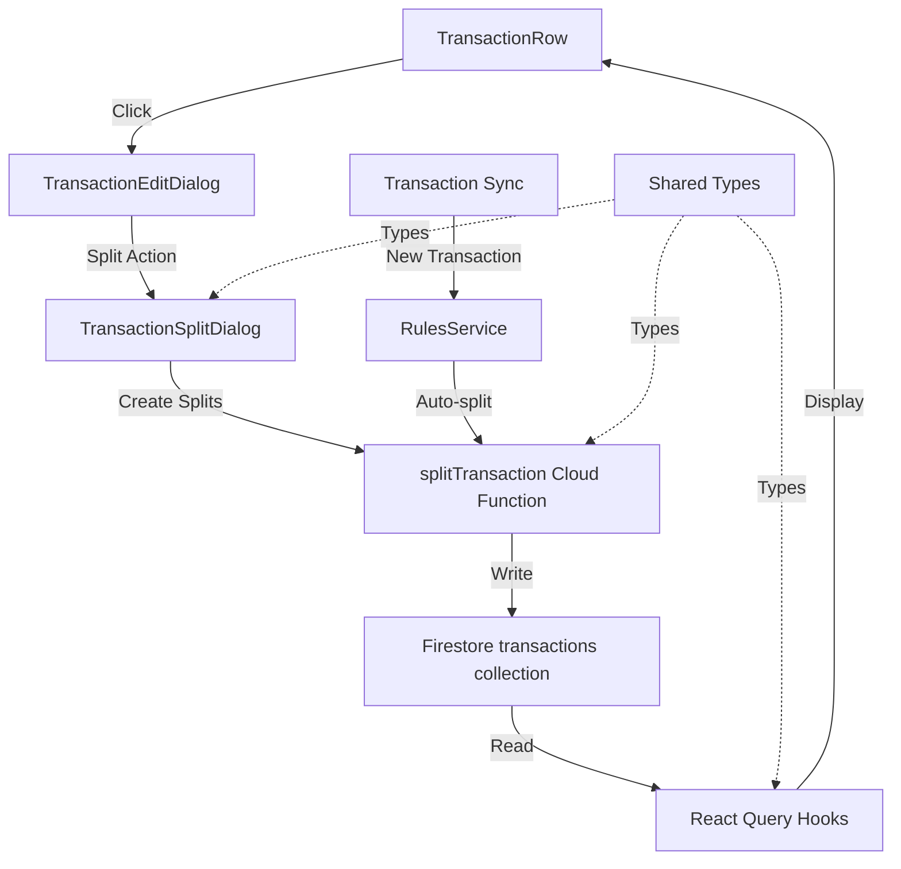
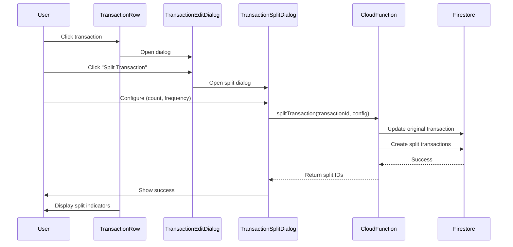

# Design Document: Transaction Splitting

## Overview

The transaction splitting feature allows users to divide a single transaction into multiple independent transactions with configurable frequency (weekly, monthly, yearly) and repetition count (up to 12 times). Split transactions maintain a reference to their parent transaction while being fully independent entities that can have their category, saving target, and other fields modified. The feature includes both manual splitting via UI and automatic rule-based splitting for matching transactions.

This design extends the existing transaction system by adding split metadata fields, a new split frequency enum, rule action extensions, and UI components for creating and managing split transactions.

## Architecture



## Main Workflow



## Components and Interfaces

### Component 1: TransactionSplitDialog

**Purpose**: UI component for configuring and creating split transactions

**Interface**:
```typescript
interface TransactionSplitDialogProps {
  open: boolean;
  onOpenChange: (open: boolean) => void;
  transaction: Transaction | null;
}

interface SplitConfiguration {
  splitCount: number;        // 2-12
  frequency: SplitFrequency; // weekly, monthly, yearly
  startDate: number;         // UTC epoch timestamp
}
```

**Responsibilities**:
- Validate split count (2-12)
- Calculate split amounts and dates based on frequency
- Preview split transactions before creation
- Call splitTransaction Cloud Function
- Handle success/error states

### Component 2: TransactionRow (Enhanced)

**Purpose**: Display transaction with split indicators

**Interface**:
```typescript
interface TransactionRowProps {
  transaction: Transaction;
  onClick: (transaction: Transaction) => void;
}
```

**Responsibilities**:
- Display split badge if transaction.splitParentId is non-null
- Query and display split position (e.g., "Split 1 of 3") by querying all splits with same splitParentId
- Highlight split transactions visually
- Allow navigation to parent transaction

### Component 3: TransactionEditDialog (Enhanced)

**Purpose**: Edit transaction with split action button

**Responsibilities**:
- Add "Split Transaction" button
- Disable split button if transaction.splitParentId is non-null (already split)
- Open TransactionSplitDialog when split button clicked

### Component 4: SplitTransactionService (Backend)

**Purpose**: Cloud Function to create split transactions

**Interface**:
```typescript
interface SplitTransactionRequest {
  transactionId: string;
  splitCount: number;
  frequency: SplitFrequency;
  startDate: number;
}

interface SplitTransactionResponse {
  success: boolean;
  splitTransactionIds: string[];
  error?: string;
}
```

**Responsibilities**:
- Validate split configuration
- Calculate split amounts (divide evenly, handle remainders)
- Calculate split dates based on frequency
- Modify original transaction to become first split (update amount, set splitParentId to self)
- Create additional split transaction documents in Firestore
- Apply user rules to new split transactions
- Handle transaction atomicity

## Data Models

### Transaction (Enhanced)

```typescript
interface Transaction {
  id: string;
  uid: string;
  institutionId: string;
  accountId: string;
  name: string;
  amount: number;
  datetime: number;
  plaidCategory: string;
  category: string;
  hidden: boolean;
  savingTargetId?: string;

  // Split transaction field (minimal design)
  splitParentId?: string;     // Self-reference if parent (id === splitParentId), parent ID if child, null if unsplit
}
```

**Validation Rules**:
- splitParentId must reference an existing transaction when non-null
- splitParentId === transaction.id indicates this is a parent (has been split)
- splitParentId !== null && splitParentId !== transaction.id indicates this is a child split

**Derived Properties**:
- `isParent = splitParentId === transaction.id`
- `isSplitChild = splitParentId !== null && splitParentId !== transaction.id`
- `isUnsplit = splitParentId === null`
- Split count, index, and total are derived by querying transactions with matching splitParentId

### SplitFrequency (New Enum)

```typescript
enum SplitFrequency {
  Weekly = 'weekly',
  Monthly = 'monthly',
  Yearly = 'yearly'
}
```

### RuleAction (Enhanced)

```typescript
interface RuleAction {
  changeCategory?: string;
  toggleHidden?: boolean;
  assignSavingTargetId?: string;

  // New split action
  autoSplit?: {
    splitCount: number;
    frequency: SplitFrequency;
  };
}
```

**Validation Rules**:
- autoSplit.splitCount must be between 2 and 12
- autoSplit.frequency must be valid SplitFrequency enum value

## Algorithmic Pseudocode

### Main Split Transaction Algorithm

```typescript
async function splitTransaction(
  transactionId: string,
  config: SplitConfiguration,
  uid: string
): Promise<SplitTransactionResponse>
```

**Preconditions:**
- transactionId references an existing transaction
- config.splitCount is between 2 and 12
- config.frequency is a valid SplitFrequency
- config.startDate is a valid UTC epoch timestamp
- Transaction is not already split (splitParentId === null)

**Postconditions:**
- Original transaction modified to become first split (amount updated, splitParentId set to self)
- config.splitCount - 1 new child transactions are created
- All transactions (parent + children) have splitParentId === originalTransactionId
- Split amounts sum to original transaction amount
- Split dates are calculated based on frequency
- User rules are applied to all new split transactions

**Algorithm:**

```typescript
async function splitTransaction(
  transactionId: string,
  config: SplitConfiguration,
  uid: string
): Promise<SplitTransactionResponse> {
  // Step 1: Validate and fetch original transaction
  const originalTxn = await getTransaction(transactionId, uid);

  if (!originalTxn) {
    throw new Error("Transaction not found");
  }

  if (originalTxn.splitParentId !== null) {
    throw new Error("Transaction is already split");
  }

  // Step 2: Calculate split amounts
  const baseAmount = Math.floor((originalTxn.amount / config.splitCount) * 100) / 100;
  const remainder = originalTxn.amount - (baseAmount * config.splitCount);
  const amounts = [baseAmount + remainder, ...Array(config.splitCount - 1).fill(baseAmount)];

  // Step 3: Calculate split dates
  const splitDates: number[] = [config.startDate];
  let currentDate = config.startDate;

  for (let i = 1; i < config.splitCount; i++) {
    currentDate = calculateNextDate(currentDate, config.frequency);
    splitDates.push(currentDate);
  }

  // Step 4: Update original transaction to become first split
  const batch = firestore.batch();
  const originalDocRef = firestore.collection('transactions').doc(originalTxn.id);
  batch.update(originalDocRef, {
    amount: amounts[0],
    splitParentId: originalTxn.id  // Self-reference indicates parent
  });

  // Step 5: Create child split transactions
  const splitTransactionIds: string[] = [originalTxn.id];

  for (let i = 1; i < config.splitCount; i++) {
    const splitTxn: Transaction = {
      ...originalTxn,
      id: generateId(),
      amount: amounts[i],
      datetime: splitDates[i],
      splitParentId: originalTxn.id
    };

    // Apply user rules to split transaction
    const processedSplitTxn = await applyUserRules(splitTxn, uid);

    const docRef = firestore.collection('transactions').doc(processedSplitTxn.id);
    batch.set(docRef, processedSplitTxn);
    splitTransactionIds.push(processedSplitTxn.id);
  }

  // Step 6: Commit batch
  await batch.commit();

  return {
    success: true,
    splitTransactionIds
  };
}
```

### Date Calculation Algorithm

```typescript
function calculateNextDate(currentDate: number, frequency: SplitFrequency): number
```

**Preconditions:**
- currentDate is a valid UTC epoch timestamp
- frequency is a valid SplitFrequency enum value

**Postconditions:**
- Returns a valid UTC epoch timestamp
- Returned date is after currentDate
- Date increment matches frequency (7 days, 1 month, 1 year)

**Algorithm:**

```typescript
function calculateNextDate(currentDate: number, frequency: SplitFrequency): number {
  const date = new Date(currentDate);

  switch (frequency) {
    case SplitFrequency.Weekly:
      date.setDate(date.getDate() + 7);
      break;

    case SplitFrequency.Monthly:
      date.setMonth(date.getMonth() + 1);
      break;

    case SplitFrequency.Yearly:
      date.setFullYear(date.getFullYear() + 1);
      break;
  }

  return date.getTime();
}
```

### Amount Distribution Algorithm

```typescript
function distributeAmount(totalAmount: number, splitCount: number): number[]
```

**Preconditions:**
- totalAmount is a valid number
- splitCount is between 2 and 12

**Postconditions:**
- Returns array of length splitCount
- Sum of returned amounts equals totalAmount
- All amounts are rounded to 2 decimal places
- First amount contains any remainder from rounding

**Algorithm:**

```typescript
function distributeAmount(totalAmount: number, splitCount: number): number[] {
  const amounts: number[] = [];

  // Calculate base amount (rounded to 2 decimals)
  const baseAmount = Math.floor((totalAmount / splitCount) * 100) / 100;

  // Calculate remainder
  const remainder = totalAmount - (baseAmount * splitCount);

  // First split gets base + remainder
  amounts.push(baseAmount + remainder);

  // Remaining splits get base amount
  for (let i = 1; i < splitCount; i++) {
    amounts.push(baseAmount);
  }

  return amounts;
}
```

### Rule-Based Auto-Split Algorithm

```typescript
function applyAutoSplitRule(transaction: Transaction, rule: RuleTransformation): boolean
```

**Preconditions:**
- transaction is a valid Transaction object
- rule contains autoSplit action
- transaction.splitParentId === null

**Postconditions:**
- Returns true if auto-split should be triggered
- Returns false if transaction doesn't match or is already split

**Algorithm:**

```typescript
function applyAutoSplitRule(transaction: Transaction, rule: RuleTransformation): boolean {
  // Skip if transaction is already split
  if (transaction.splitParentId !== null) {
    return false;
  }

  // Skip if rule doesn't have autoSplit action
  if (!rule.action.autoSplit) {
    return false;
  }

  // Check if transaction matches rule criteria
  if (!evaluateRuleCriteria(transaction, rule.matchingCriteria)) {
    return false;
  }

  // Trigger auto-split
  const config: SplitConfiguration = {
    splitCount: rule.action.autoSplit.splitCount,
    frequency: rule.action.autoSplit.frequency,
    startDate: transaction.datetime
  };

  // Queue split transaction job
  await splitTransaction(transaction.id, config, transaction.uid);

  return true;
}
```

## Key Functions with Formal Specifications

### Function 1: splitTransaction()

```typescript
async function splitTransaction(
  transactionId: string,
  config: SplitConfiguration,
  uid: string
): Promise<SplitTransactionResponse>
```

**Preconditions:**
- `transactionId` is non-empty string referencing existing transaction
- `config.splitCount` ∈ [2, 12]
- `config.frequency` ∈ {weekly, monthly, yearly}
- `config.startDate` > 0 (valid epoch timestamp)
- Transaction with `transactionId` has `splitParentId === null`
- User `uid` owns the transaction

**Postconditions:**
- Original transaction modified: amount updated to first split amount, splitParentId set to self (transactionId)
- Exactly `config.splitCount - 1` new child transactions created
- ∀ transaction t with t.splitParentId === transactionId: t represents a split
- Sum of all split amounts === original transaction amount
- All split transactions have user rules applied
- Returns success response with array of split transaction IDs

**Loop Invariants:**
- For split creation loop: Running sum of amounts ≤ original amount
- For date calculation loop: All calculated dates are monotonically increasing

### Function 2: calculateNextDate()

```typescript
function calculateNextDate(currentDate: number, frequency: SplitFrequency): number
```

**Preconditions:**
- `currentDate` > 0 (valid epoch timestamp)
- `frequency` ∈ {weekly, monthly, yearly}

**Postconditions:**
- Returns valid epoch timestamp > currentDate
- If frequency === weekly: result === currentDate + 7 days
- If frequency === monthly: result === currentDate + 1 month (same day)
- If frequency === yearly: result === currentDate + 1 year (same month/day)
- No mutations to input parameters

### Function 3: distributeAmount()

```typescript
function distributeAmount(totalAmount: number, splitCount: number): number[]
```

**Preconditions:**
- `totalAmount` is valid number
- `splitCount` ∈ [2, 12]

**Postconditions:**
- Returns array of length === splitCount
- ∀ amount in result: amount is rounded to 2 decimal places
- Sum of all amounts in result === totalAmount (within floating point precision)
- result[0] >= result[i] for all i > 0 (first element contains remainder)
- No mutations to input parameters

**Loop Invariants:**
- All amounts added to result array are positive
- Running sum of amounts ≤ totalAmount

### Function 4: validateSplitConfiguration()

```typescript
function validateSplitConfiguration(config: SplitConfiguration): boolean
```

**Preconditions:**
- `config` is defined object

**Postconditions:**
- Returns true if and only if all validation rules pass
- Returns false if any validation rule fails
- No side effects or mutations

**Validation Rules:**
- config.splitCount ∈ [2, 12]
- config.frequency ∈ {weekly, monthly, yearly}
- config.startDate > 0

## Example Usage

```typescript
// Example 1: Manual split via UI
const handleSplitTransaction = async () => {
  const config: SplitConfiguration = {
    splitCount: 3,
    frequency: SplitFrequency.Monthly,
    startDate: transaction.datetime
  };

  const response = await splitTransactionMutation.mutateAsync({
    transactionId: transaction.id,
    config
  });

  if (response.success) {
    toast.success(`Created ${response.splitTransactionIds.length} split transactions`);
  }
};

// Example 2: Display split indicator in TransactionRow
const SplitBadge = ({ transaction }: { transaction: Transaction }) => {
  if (!transaction.splitParentId) return null;

  const isParent = transaction.splitParentId === transaction.id;

  // Query to get split count and position
  const { data: splits } = useSplitTransactions(transaction.splitParentId);
  const splitIndex = splits?.findIndex(s => s.id === transaction.id) + 1;
  const splitTotal = splits?.length;

  return (
    <span className="text-xs bg-blue-100 text-blue-800 px-2 py-1 rounded">
      {isParent
        ? `Parent (${splitTotal} splits)`
        : `Split ${splitIndex} of ${splitTotal}`
      }
    </span>
  );
};

// Example 3: Auto-split rule configuration
const autoSplitRule: RuleTransformation = {
  name: "Auto-split Netflix subscription",
  enabled: true,
  matchingCriteria: {
    name: {
      value: "Netflix",
      condition: RuleCondition.Contains
    },
    amount: {
      value: 15.99,
      condition: RuleCondition.Equal
    }
  },
  action: {
    changeCategory: CSPCategory.Subscriptions,
    autoSplit: {
      splitCount: 12,
      frequency: SplitFrequency.Monthly
    }
  }
};

// Example 4: Query split transactions
const useSplitTransactions = (parentId: string) => {
  return useQuery({
    queryKey: ['transactions', 'splits', parentId],
    queryFn: async () => {
      const snapshot = await firestore
        .collection('transactions')
        .where('splitParentId', '==', parentId)
        .orderBy('datetime', 'asc')
        .get();

      return snapshot.docs.map(doc => doc.data() as Transaction);
    }
  });
};

// Example 5: Plaid update handler - recalculate split amounts
async function handlePlaidUpdate(plaidTransaction: PlaidTransaction) {
  const existingTxn = await getTransaction(plaidTransaction.transaction_id);

  // Check if this is a split parent (self-reference)
  if (existingTxn?.splitParentId === existingTxn?.id) {
    const amountChanged = existingTxn.amount !== plaidTransaction.amount;

    if (amountChanged) {
      // Get all splits (including parent)
      const allSplits = await firestore
        .collection('transactions')
        .where('splitParentId', '==', existingTxn.id)
        .orderBy('datetime', 'asc')
        .get();

      // Recalculate amounts
      const splitCount = allSplits.size;
      const newAmounts = distributeAmount(plaidTransaction.amount, splitCount);

      // Update only amounts, preserve all other fields
      const batch = firestore.batch();
      allSplits.docs.forEach((doc, index) => {
        batch.update(doc.ref, { amount: newAmounts[index] });
      });

      await batch.commit();
    }
  }
}
```

## Correctness Properties

*A property is a characteristic or behavior that should hold true across all valid executions of a system—essentially, a formal statement about what the system should do. Properties serve as the bridge between human-readable specifications and machine-verifiable correctness guarantees.*

### Property 1: Split Amount Conservation

*For any* transaction that is split with a valid configuration, the sum of all created split transaction amounts SHALL equal the original transaction amount within 0.01 precision.

**Validates: Requirements 2.3, 2.4**

### Property 2: Split Parent Reference Completeness

*For any* transaction that is split, all created split transactions (including the parent) SHALL have splitParentId set to the original transaction's ID.

**Validates: Requirements 4.1, 4.2**

### Property 3: Split Date Monotonicity

*For any* set of split transactions from the same parent, when ordered by datetime, the datetime values SHALL be strictly increasing.

**Validates: Requirements 3.5**

### Property 4: Split Date Frequency Correctness

*For any* split configuration with a specified frequency, each subsequent split date SHALL be calculated as the previous date plus the frequency interval (7 days for weekly, 1 month for monthly, 1 year for yearly).

**Validates: Requirements 3.1, 3.2, 3.3**

### Property 5: Split Parent Reference Integrity

*For any* split transaction where splitParentId is non-null, the splitParentId SHALL reference an existing transaction.

**Validates: Requirements 13.1, 13.2, 13.4**

### Property 6: Split Parent Self-Reference

*For any* transaction that has been split (is a parent), splitParentId SHALL equal the transaction's own ID.

**Validates: Requirements 4.3**

### Property 7: Split Transaction Independence

*For any* split transaction, modifying its category, savingTargetId, or hidden fields SHALL not modify the parent transaction or any sibling split transactions.

**Validates: Requirements 5.1, 5.2, 5.3, 5.4**

### Property 8: No Recursive Splits

*For any* transaction where splitParentId is non-null, attempting to split it again SHALL result in an error.

**Validates: Requirements 1.6, 9.3**

### Property 9: Split Configuration Validation

*For any* split configuration, validation SHALL reject configurations where splitCount is not between 2 and 12 inclusive, frequency is not a valid SplitFrequency value, or startDate is not a positive epoch timestamp.

**Validates: Requirements 1.3, 14.1, 14.2, 14.3**

### Property 10: Split Transaction Atomicity

*For any* split operation, if any write operation fails, no split transactions SHALL be created and the original transaction SHALL remain unchanged.

**Validates: Requirements 10.2, 10.3**

### Property 11: User Rule Application to Splits

*For any* newly created split transaction, all matching user rules SHALL be evaluated and applied before the split is persisted to the database.

**Validates: Requirements 11.1, 11.2, 11.3**

### Property 12: Auto-Split Rule Validation

*For any* rule with an autoSplit action, the splitCount SHALL be between 2 and 12 and the frequency SHALL be a valid SplitFrequency value.

**Validates: Requirements 7.1, 7.2**

### Property 13: Auto-Split Triggering

*For any* new transaction that matches a rule with an autoSplit action and is not already split, the Split_Service SHALL be triggered with the rule's configured parameters using the transaction's datetime as the start date.

**Validates: Requirements 7.3, 7.5**

### Property 14: Split Query Ordering

*For any* query for split transactions by parent ID, the results SHALL be ordered by datetime in ascending order.

**Validates: Requirements 8.2**

### Property 15: Split Ownership Verification

*For any* split operation, the Split_Service SHALL verify that the requesting user owns the transaction before proceeding with the split.

**Validates: Requirements 12.1**

## Error Handling

### Error Scenario 1: Invalid Split Count

**Condition**: User attempts to split with count < 2 or > 12
**Response**: Validation error before Cloud Function call
**Recovery**: Display error message, keep dialog open for correction

### Error Scenario 2: Transaction Already Split

**Condition**: User attempts to split a transaction that has splitParentId !== null
**Response**: Cloud Function returns error
**Recovery**: Display error message, disable split button in UI

### Error Scenario 3: Insufficient Permissions

**Condition**: User attempts to split transaction they don't own
**Response**: Cloud Function validates uid ownership, returns permission error
**Recovery**: Display error message, close dialog

### Error Scenario 4: Firestore Write Failure

**Condition**: Batch commit fails during split creation
**Response**: Transaction rolled back, no partial splits created
**Recovery**: Display error message, allow retry

### Error Scenario 5: Invalid Date Calculation

**Condition**: Date calculation produces invalid timestamp (e.g., Feb 30)
**Response**: Date library handles edge cases (e.g., Feb 28/29)
**Recovery**: Use library's default behavior for invalid dates

## Testing Strategy

### Unit Testing Approach

Test individual functions in isolation:

- `distributeAmount()`: Test with various amounts and split counts, verify sum conservation
- `calculateNextDate()`: Test all frequencies, verify date increments, test edge cases (month boundaries, leap years)
- `validateSplitConfiguration()`: Test all validation rules, boundary conditions
- `applyAutoSplitRule()`: Test rule matching logic, verify auto-split triggering

**Key Test Cases**:
- Split count boundaries (2, 12, 1, 13)
- Amount distribution with remainders (e.g., $100 / 3 = $33.34, $33.33, $33.33)
- Date calculations across month/year boundaries
- Leap year handling for yearly frequency

### Property-Based Testing Approach

Use property-based testing to verify correctness properties across random inputs.

**Property Test Library**: fast-check (for TypeScript/JavaScript)

**Properties to Test**:
1. Amount Conservation: For any valid split configuration, sum of splits equals original
2. Split Index Uniqueness: Generated split indices are always unique and sequential
3. Date Monotonicity: Generated dates are always increasing
4. Idempotency: Splitting same transaction with same config produces same result
5. Reversibility: Deleting all splits and recreating produces equivalent transactions

**Example Property Test**:
```typescript
import fc from 'fast-check';

test('split amounts always sum to original amount', () => {
  fc.assert(
    fc.property(
      fc.float({ min: 0.01, max: 10000 }), // original amount
      fc.integer({ min: 2, max: 12 }),      // split count
      (amount, count) => {
        const splits = distributeAmount(amount, count);
        const sum = splits.reduce((a, b) => a + b, 0);
        expect(Math.abs(sum - amount)).toBeLessThan(0.01);
      }
    )
  );
});
```

### Integration Testing Approach

Test end-to-end workflows with Firestore emulator:

1. **Manual Split Flow**: Create transaction → Split via UI → Verify splits in Firestore → Verify UI updates
2. **Auto-Split Rule Flow**: Create rule → Sync transaction → Verify auto-split triggered → Verify splits created
3. **Split Transaction Editing**: Create splits → Edit split category → Verify independence from parent
4. **Split Transaction Deletion**: Create splits → Delete one split → Verify others unaffected
5. **Query Performance**: Create 1000 transactions with splits → Query by splitParentId → Verify performance

## Performance Considerations

### Firestore Query Optimization

- Add composite index on `(uid, isSplit, splitParentId)` for efficient split queries
- Add composite index on `(uid, datetime)` for date-range queries including splits
- Use `orderBy('splitIndex')` when querying splits to maintain order

### Batch Write Optimization

- Use Firestore batch writes to create all splits atomically (max 500 operations per batch)
- For split counts > 500 (not applicable here, max is 12), use chunked batches

### UI Performance

- Use React Query caching to avoid re-fetching split transactions
- Implement optimistic updates for split creation (show splits immediately, rollback on error)
- Use virtualization for transaction lists with many splits

### Cloud Function Optimization

- Calculate all split data before starting Firestore writes
- Use parallel rule processing for split transactions
- Set appropriate timeout (60s) for split operations

## Security Considerations

### Firestore Security Rules

```javascript
// Allow users to read their own transactions
match /transactions/{transactionId} {
  allow read: if request.auth != null &&
                 resource.data.uid == request.auth.uid;

  // Prevent direct creation of split transactions (must use Cloud Function)
  allow create: if request.auth != null &&
                   request.resource.data.uid == request.auth.uid &&
                   request.resource.data.splitParentId == null;

  allow update: if request.auth != null &&
                   resource.data.uid == request.auth.uid &&
                   // Allow category/savingTargetId/hidden changes on splits
                   // Prevent changing splitParentId directly
                   (request.resource.data.diff(resource.data).affectedKeys()
                     .hasOnly(['category', 'savingTargetId', 'hidden']));
}
```

### Cloud Function Security

- Validate user owns transaction before splitting
- Validate split configuration parameters
- Rate limit split operations (max 10 per minute per user)
- Log all split operations for audit trail

### Data Integrity

- Use Firestore transactions for atomic split creation
- Validate splitParentId references exist before creating splits
- Prevent circular references (split cannot reference itself)

## Dependencies

### Frontend Dependencies
- `@tanstack/react-query` (existing) - Data fetching and caching
- `lucide-react` (existing) - Icons for split indicators
- `date-fns` (new) - Date manipulation for split date calculations

### Backend Dependencies
- `firebase-admin` (existing) - Firestore access
- `@easy-csp/shared-types` (existing) - Shared type definitions

### Shared Types Updates
- Add `SplitFrequency` enum
- Add `splitParentId` field to `Transaction` interface
- Add `autoSplit` to `RuleAction` interface

### Firestore Indexes Required
```json
{
  "indexes": [
    {
      "collectionGroup": "transactions",
      "queryScope": "COLLECTION",
      "fields": [
        { "fieldPath": "uid", "order": "ASCENDING" },
        { "fieldPath": "splitParentId", "order": "ASCENDING" },
        { "fieldPath": "datetime", "order": "ASCENDING" }
      ]
    }
  ]
}
```
