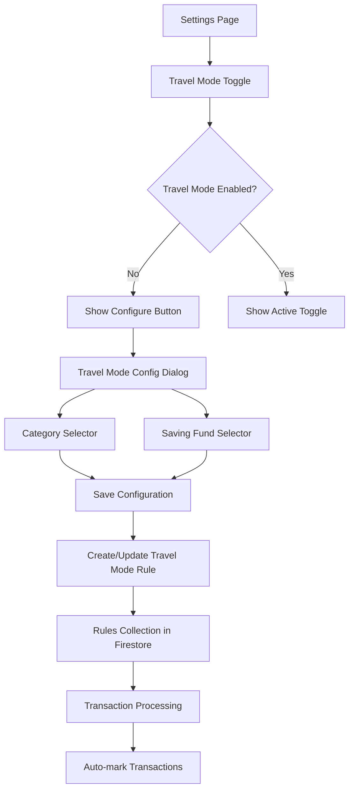
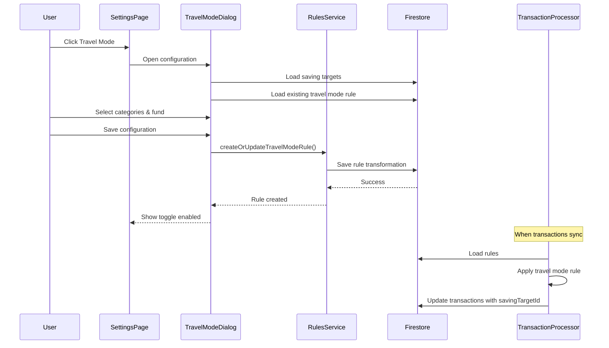

# Design Document: Travel Mode

## Overview

Travel Mode is a settings-based feature that automatically marks transactions from selected categories to a designated saving fund during travel periods. The feature leverages the existing rules system to power the automatic transaction marking, providing users with a simplified interface to manage travel-related spending without manually creating complex rules.

The feature integrates seamlessly into the existing Settings page and uses the Rule system's RuleTransformation interface with assignSavingTargetId action to redirect transactions to a user-selected saving fund.

## Architecture



## Main Workflow



## Components and Interfaces

### Component 1: TravelModeSettingsRow

**Purpose**: Display travel mode option in Settings page with toggle and configuration access

**Interface**:
```typescript
interface TravelModeSettingsRowProps {
  // No props needed - fetches data internally via React Query
}

// No custom state type needed - works directly with Rule from Firestore
```

**Responsibilities**:
- Display travel mode status (enabled/disabled via toggle when configured)
- Show toggle switch on right side when configured
- Open configuration dialog when row is clicked
- Handle toggle click separately (enable/disable without opening dialog)
- Prevent dialog from opening when toggle is clicked

### Component 2: TravelModeConfigDialog

**Purpose**: Modal dialog for configuring travel mode categories and saving fund

**Interface**:
```typescript
interface TravelModeConfigDialogProps {
  open: boolean;
  onClose: () => void;
  existingConfig?: TravelModeConfig;
}

interface TravelModeConfig {
  categories: string[];
  savingTargetId: string;
}
```

**Responsibilities**:
- Display categories grouped by CSP bucket with checkboxes
- Pre-select guilt-free spending categories by default (first time only)
- Display saving fund selector using SavingTargetSelector
- Validate configuration (at least one category and one fund selected)
- Save configuration to Firestore via rules service
- Handle loading and error states

### Component 3: TravelModeRulesService

**Purpose**: Service layer for managing travel mode rules in Firestore

**Interface**:
```typescript
interface TravelModeRulesService {
  getTravelModeRule(uid: string): Promise<RuleTransformation | null>;
  createOrUpdateTravelModeRule(
    uid: string,
    config: TravelModeConfig
  ): Promise<void>;
  toggleTravelMode(uid: string, enabled: boolean): Promise<void>;
  deleteTravelModeRule(uid: string): Promise<void>;
}
```

**Responsibilities**:
- Fetch existing travel mode rule from Firestore
- Create or update travel mode rule transformation
- Enable/disable travel mode rule
- Delete travel mode rule
- Handle Firestore transactions for rule updates

## Data Models

### TravelModeConfig

```typescript
interface TravelModeConfig {
  categories: string[];      // CSP categories to match (e.g., ['diningOut', 'others', 'gifts'])
  savingTargetId: string;    // ID of the saving fund to mark transactions to
}
```

**Validation Rules**:
- categories must be non-empty array
- categories must contain valid CSPCategory values
- savingTargetId must be a valid existing SavingTarget ID

### TravelModeRule (extends RuleTransformation)

```typescript
interface TravelModeRule extends RuleTransformation {
  name: '__system:travel-mode';  // System-managed identifier (reserved prefix)
  enabled: boolean;              // Whether travel mode is active
  matchingCriteria: {
    category: {
      value: string;              // One of the selected categories
      condition: RuleCondition.Exact;
    };
  };
  action: {
    assignSavingTargetId: string;  // The selected saving fund ID
  };
}
```

**Storage Strategy**:
- Travel mode creates ONE rule transformation per category
- All travel mode rules stored in user's Rule document
- Rules are tagged with name: `__system:travel-mode` for identification
- The `__system:` prefix is reserved for system-managed rules
- When toggling off, rules are disabled (enabled: false) not deleted
- When reconfiguring, old travel mode rules are replaced

## Key Functions with Formal Specifications

### Function 1: getTravelModeConfig()

```typescript
function getTravelModeConfig(uid: string): Promise<TravelModeConfig | null>
```

**Preconditions:**
- uid is non-empty string
- User is authenticated

**Postconditions:**
- Returns TravelModeConfig if travel mode rules exist
- Returns null if no travel mode rules found
- Throws error if Firestore read fails

**Algorithm:**
1. Query user's Rule document from Firestore
2. Filter transformations where name === 'Travel Mode'
3. If no travel mode rules found, return null
4. Extract categories from all travel mode rules' matchingCriteria
5. Extract savingTargetId from first rule's action
6. Return TravelModeConfig object

### Function 2: createOrUpdateTravelModeRule()

```typescript
function createOrUpdateTravelModeRule(
  uid: string,
  config: TravelModeConfig
): Promise<void>
```

**Preconditions:**
- uid is non-empty string
- config.categories is non-empty array of valid CSPCategory values
- config.savingTargetId is valid existing SavingTarget ID
- User is authenticated

**Postconditions:**
- Travel mode rules created/updated in Firestore
- Old travel mode rules removed
- New rules are enabled by default
- Transaction succeeds atomically or rolls back

**Algorithm:**
1. Validate config (categories non-empty, savingTargetId exists)
2. Start Firestore transaction
3. Load user's Rule document
4. Remove all existing transformations where name === 'Travel Mode'
5. For each category in config.categories:
   - Create new RuleTransformation with:
     - name: 'Travel Mode'
     - enabled: true
     - matchingCriteria: { category: { value: category, condition: Exact } }
     - action: { assignSavingTargetId: config.savingTargetId }
6. Append new transformations to Rule document
7. Commit transaction

### Function 3: toggleTravelMode()

```typescript
function toggleTravelMode(uid: string, enabled: boolean): Promise<void>
```

**Preconditions:**
- uid is non-empty string
- Travel mode rules exist for user
- User is authenticated

**Postconditions:**
- All travel mode rules' enabled field set to specified value
- Transaction succeeds atomically or rolls back

**Algorithm:**
1. Start Firestore transaction
2. Load user's Rule document
3. Find all transformations where name === 'Travel Mode'
4. Set enabled field to specified value for each
5. Update Rule document
6. Commit transaction

### Function 4: getDefaultTravelCategories()

```typescript
function getDefaultTravelCategories(): string[]
```

**Preconditions:**
- None

**Postconditions:**
- Returns array of CSPCategory values from GuildFreeSpending bucket
- Array is non-empty

**Algorithm:**
1. Import CSP_CATEGORY_TO_BUCKET_MAPPING from shared-types
2. Filter entries where bucket === CSPBucket.GuildFreeSpending
3. Extract category keys
4. Return array of category strings

## Algorithmic Pseudocode

### Main Configuration Save Algorithm

```typescript
async function saveTravelModeConfiguration(
  uid: string,
  categories: string[],
  savingTargetId: string
): Promise<void> {
  // Step 1: Validate inputs
  if (!uid || categories.length === 0 || !savingTargetId) {
    throw new Error('Invalid configuration');
  }

  // Step 2: Verify saving target exists
  const savingTarget = await getSavingTarget(savingTargetId);
  if (!savingTarget) {
    throw new Error('Saving target not found');
  }

  // Step 3: Create rule transformations
  const travelModeRules: RuleTransformation[] = categories.map(category => ({
    name: '__system:travel-mode',
    enabled: true,
    matchingCriteria: {
      category: {
        value: category,
        condition: RuleCondition.Exact
      }
    },
    action: {
      assignSavingTargetId: savingTargetId
    }
  }));

  // Step 4: Update Firestore atomically
  await firestore.runTransaction(async (transaction) => {
    const ruleDocRef = doc(firestore, RULES_COLLECTION, uid);
    const ruleDoc = await transaction.get(ruleDocRef);

    let transformations: RuleTransformation[] = [];

    if (ruleDoc.exists()) {
      const existingRule = ruleDoc.data() as Rule;
      // Remove old travel mode rules
      transformations = existingRule.transformations.filter(
        t => t.name !== '__system:travel-mode'
      );
    }

    // Add new travel mode rules
    transformations.push(...travelModeRules);

    // Save updated rules
    transaction.set(ruleDocRef, {
      uid,
      transformations
    });
  });
}
```

### Travel Mode Status Check Algorithm

```typescript
// System-managed rule identifier
const TRAVEL_MODE_RULE_NAME = '__system:travel-mode';

// Helper functions to work directly with Rule
function getTravelModeRules(rule: Rule | null): RuleTransformation[] {
  if (!rule?.transformations) return [];
  return rule.transformations.filter(t => t.name === TRAVEL_MODE_RULE_NAME);
}

function isTravelModeConfigured(rule: Rule | null): boolean {
  return getTravelModeRules(rule).length > 0;
}

function isTravelModeEnabled(rule: Rule | null): boolean {
  const travelRules = getTravelModeRules(rule);
  return travelRules.length > 0 && travelRules.every(t => t.enabled);
}

function getTravelModeConfig(rule: Rule | null): TravelModeConfig | null {
  const travelRules = getTravelModeRules(rule);
  if (travelRules.length === 0) return null;

  const categories = travelRules
    .map(t => t.matchingCriteria.category?.value)
    .filter(Boolean) as string[];

  const savingTargetId = travelRules[0].action.assignSavingTargetId;
  if (!savingTargetId) return null;

  return { categories, savingTargetId };
}
```

## Example Usage

### Example 1: Configuration Dialog with Grouped Categories

```typescript
// Dialog showing categories grouped by bucket
const TravelModeConfigDialog = ({ open, onClose }) => {
  const { data: rule } = useUserRules();
  const { data: csp } = useConsciousSpendingPlan();
  const { mutate: saveConfig } = useSaveTravelMode();

  const existingConfig = getTravelModeConfig(rule);
  const [selectedCategories, setSelectedCategories] = useState<string[]>(
    existingConfig?.categories || getDefaultTravelCategories()
  );
  const [savingTargetId, setSavingTargetId] = useState(
    existingConfig?.savingTargetId || ''
  );

  const handleSave = () => {
    saveConfig(
      { categories: selectedCategories, savingTargetId },
      {
        onSuccess: () => {
          onClose();
          toast.success('Travel mode configured');
        }
      }
    );
  };

  return (
    <Dialog open={open} onClose={onClose}>
      <DialogTitle>Configure Travel Mode</DialogTitle>
      <DialogContent>
        {/* Categories grouped by bucket */}
        {Object.entries(csp).map(([bucket, budgets]) => (
          <div key={bucket}>
            <h3>{bucketLabel(bucket)}</h3>
            {budgets.map(budget => (
              <label key={budget.category}>
                <input
                  type="checkbox"
                  checked={selectedCategories.includes(budget.category)}
                  onChange={(e) => {
                    if (e.target.checked) {
                      setSelectedCategories([...selectedCategories, budget.category]);
                    } else {
                      setSelectedCategories(
                        selectedCategories.filter(c => c !== budget.category)
                      );
                    }
                  }}
                />
                {budget.name || camelCaseToSentence(budget.category)}
              </label>
            ))}
          </div>
        ))}

        <SavingTargetSelector
          value={savingTargetId}
          onChange={setSavingTargetId}
        />
      </DialogContent>
      <DialogActions>
        <Button onClick={onClose}>Cancel</Button>
        <Button
          onClick={handleSave}
          disabled={selectedCategories.length === 0 || !savingTargetId}
        >
          Save
        </Button>
      </DialogActions>
    </Dialog>
  );
};
```

### Example 2: Travel Mode Settings Row

```typescript
// Clickable row with toggle
const TravelModeSettingsRow = () => {
  const [dialogOpen, setDialogOpen] = useState(false);
  const { data: rule } = useUserRules();
  const { mutate: toggle } = useToggleTravelMode();

  const configured = isTravelModeConfigured(rule);
  const enabled = isTravelModeEnabled(rule);

  const handleRowClick = () => {
    setDialogOpen(true);
  };

  const handleToggle = (e: React.MouseEvent, newEnabled: boolean) => {
    e.stopPropagation(); // Don't open dialog
    toggle(newEnabled, {
      onSuccess: () => {
        toast.success(
          newEnabled ? 'Travel mode activated' : 'Travel mode deactivated'
        );
      }
    });
  };

  return (
    <>
      <button
        onClick={handleRowClick}
        className="w-full flex items-center justify-between rounded-lg hover:bg-gray-100 transition-colors p-2"
      >
        <div className="flex items-center gap-3">
          <Plane className="w-5 h-5 text-gray-600" />
          <div className="text-left">
            <p className="font-medium">Travel Mode</p>
            <p className="text-sm text-gray-500">Auto-mark travel spending to a fund</p>
          </div>
        </div>
        <div className="flex items-center gap-2">
          {configured && (
            <Switch
              checked={enabled}
              onCheckedChange={(checked) => handleToggle(event, checked)}
              onClick={(e) => e.stopPropagation()}
            />
          )}
          <ChevronRight className="w-5 h-5 text-gray-400" />
        </div>
      </button>

      <TravelModeConfigDialog
        open={dialogOpen}
        onClose={() => setDialogOpen(false)}
      />
    </>
  );
};
```

### Example 3: Default Categories

```typescript
// Get default guilt-free spending categories
const defaultCategories = getDefaultTravelCategories();
// Returns: ['gifts', 'diningOut', 'others']

// Use in dialog initialization
const TravelModeConfigDialog = () => {
  const { data: rule } = useUserRules();
  const existingConfig = getTravelModeConfig(rule);

  const [categories, setCategories] = useState(
    existingConfig?.categories || getDefaultTravelCategories()
  );

  // ... rest of component
};
```

## Correctness Properties

### Property 1: Travel Mode Rule Uniqueness
For all users u and all times t, if travel mode is configured for user u at time t, then there exists exactly one set of travel mode rules in u's Rule document, and all rules have name === '__system:travel-mode'.

### Property 2: Category Coverage
For all travel mode configurations c, if c is valid, then c.categories is a non-empty subset of valid CSPCategory values, and each category appears in exactly one travel mode rule.

### Property 3: Atomic Updates
For all travel mode configuration updates, either all travel mode rules are successfully updated in Firestore, or none are updated (transaction atomicity).

### Property 4: Saving Target Consistency
For all travel mode rules r, if r.action.assignSavingTargetId === s, then s must reference an existing SavingTarget document in Firestore at the time of rule creation.

### Property 5: Toggle Consistency
For all users u, if travel mode is toggled to state e (enabled/disabled), then all travel mode rules for user u have enabled === e after the toggle operation completes.

### Property 6: Default Categories
For all new travel mode configurations where user has not previously configured categories, the default categories are exactly the set of categories where CSP_CATEGORY_TO_BUCKET_MAPPING[category] === CSPBucket.GuildFreeSpending.

## Error Handling

### Error Scenario 1: Saving Target Not Found

**Condition**: User selects a saving target that was deleted before saving configuration
**Response**: Display error message "Selected saving fund no longer exists"
**Recovery**: Reload saving targets list and prompt user to select a different fund

### Error Scenario 2: No Categories Selected

**Condition**: User attempts to save configuration without selecting any categories
**Response**: Display validation error "Please select at least one category"
**Recovery**: Disable save button until at least one category is selected

### Error Scenario 3: Firestore Transaction Failure

**Condition**: Network error or permission error during rule save
**Response**: Display error message "Failed to save travel mode configuration"
**Recovery**: Retry button to attempt save again, or cancel to close dialog

### Error Scenario 4: Travel Mode Not Configured

**Condition**: User attempts to toggle travel mode before configuring it
**Response**: Show "Configure" button instead of toggle
**Recovery**: Open configuration dialog when button is clicked

## Testing Strategy

### Unit Testing Approach

Test individual functions in isolation:
- getTravelModeConfig: Mock Firestore reads, verify correct parsing of rules
- createOrUpdateTravelModeRule: Mock Firestore transactions, verify rule creation logic
- toggleTravelMode: Mock Firestore updates, verify enabled field changes
- getDefaultTravelCategories: Verify returns correct guilt-free categories

### Property-Based Testing Approach

**Property Test Library**: fast-check (for TypeScript)

**Property 1: Rule Creation Idempotency**
- Generate random valid TravelModeConfig
- Call createOrUpdateTravelModeRule twice with same config
- Verify final state is identical to calling once

**Property 2: Category Uniqueness**
- Generate random array of categories (with potential duplicates)
- Create travel mode rules
- Verify each category appears in exactly one rule

**Property 3: Toggle Reversibility**
- Generate random initial enabled state
- Toggle to opposite state, then toggle back
- Verify final state matches initial state

### Integration Testing Approach

Test complete workflows:
1. Configure travel mode → Verify rules created in Firestore
2. Toggle travel mode on/off → Verify transactions are marked/unmarked
3. Reconfigure travel mode → Verify old rules replaced with new rules
4. Delete saving target → Verify travel mode rules are invalidated

## Performance Considerations

- Travel mode rules are loaded once on Settings page mount via React Query
- Rule updates use Firestore transactions to ensure atomicity
- Category selector uses virtualization for large category lists (if needed)
- Saving target selector fetches data via React Query with caching

## Security Considerations

- All Firestore operations validate user authentication (uid)
- Rules can only be created/modified by the owning user
- Saving target IDs are validated to ensure they belong to the user
- Category values are validated against CSPCategory enum

## Dependencies

- React Query (`@tanstack/react-query`) - Data fetching and caching
- Firebase SDK - Firestore operations
- `easy-csp-shared-types` - Type definitions (Rule, RuleTransformation, CSPCategory, SavingTarget)
- Existing components:
  - `SavingTargetSelector` - For selecting saving fund
  - `Card`, `CardContent`, `CardHeader` - UI components
  - `Button`, `Switch` - Form controls
- `lucide-react` - Icons (Plane icon for travel mode)
