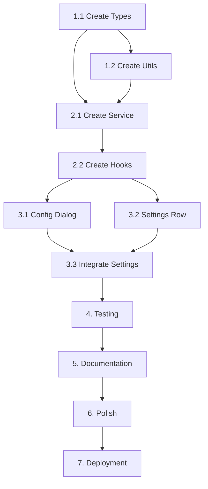

# Tasks: Travel Mode

## 1. Setup and Type Definitions

### 1.1 Create Travel Mode Types
- [x] Create `src/types/travelMode.ts` with TravelModeConfig interface only
- [x] Define constant `TRAVEL_MODE_RULE_NAME = '__system:travel-mode'`
- [x] Export types and constant for use across components
- [x] Note: No TravelModeState needed - work directly with Rule type

### 1.2 Create Travel Mode Utility Functions
- [x] Create `src/utils/travelModeUtils.ts`
- [x] Import `TRAVEL_MODE_RULE_NAME` constant
- [x] Implement `getDefaultTravelCategories()` function
- [x] Implement `getTravelModeRules(rule)` helper to filter rules by `TRAVEL_MODE_RULE_NAME`
- [x] Implement `isTravelModeConfigured(rule)` helper
- [x] Implement `isTravelModeEnabled(rule)` helper
- [x] Implement `getTravelModeConfig(rule)` to extract config from rules
- [-] Add unit tests for utility functions

## 2. Firestore Service Layer

### 2.1 Create Travel Mode Rules Service
- [x] Create `src/services/travelModeService.ts`
- [x] Implement `getTravelModeRule(uid: string)` function
- [x] Implement `createOrUpdateTravelModeRule(uid: string, config: TravelModeConfig)` function
- [x] Implement `toggleTravelMode(uid: string, enabled: boolean)` function
- [x] Use Firestore transactions for atomic updates
- [x] Add error handling for all service functions

### 2.2 Create React Query Hooks
- [x] Create `src/hooks/useTravelMode.ts`
- [x] Implement `useUserRules()` hook to fetch Rule document (or reuse if exists)
- [x] Implement `useSaveTravelMode()` hook using useMutation
- [x] Implement `useToggleTravelMode()` hook using useMutation
- [x] Configure query invalidation on mutations to refetch Rule
- [x] Add loading and error states
- [x] Note: No separate status hook needed - components use Rule + helper functions

## 3. UI Components

### 3.1 Create Travel Mode Configuration Dialog
- [x] Create `src/components/TravelModeConfigDialog.tsx`
- [x] Display categories grouped by CSP bucket (Income, Fixed Cost, Savings, Investment, Guilt-Free Spending, Ignored)
- [x] Add checkbox for each category within its bucket group
- [x] Integrate existing SavingTargetSelector component
- [x] Implement form validation (at least one category, one fund)
- [x] Add Save and Cancel buttons
- [x] Show loading state during save operation
- [x] Display error messages
- [x] Pre-select default guilt-free categories on first use only
- [x] Load existing configuration when editing (show selected categories)

### 3.2 Create Travel Mode Settings Row Component
- [x] Create `src/components/TravelModeSettingsRow.tsx`
- [x] Display Plane icon, title, subtitle, and ChevronRight
- [x] Make entire row clickable to open configuration dialog
- [x] Show toggle switch on right side when configured
- [x] Handle toggle click separately (stopPropagation to prevent dialog opening)
- [x] Handle toggle state changes (enable/disable travel mode)
- [x] Show loading state during toggle operation
- [x] Display toast notifications on success/error

### 3.3 Integrate into Settings Page
- [x] Update `src/pages/SettingsPage.tsx`
- [x] Add TravelModeSettingsRow to Manage card
- [x] Position between existing management options
- [x] Ensure consistent styling with other rows

## 4. Testing

### 4.1 Unit Tests
- [ ] Test `getDefaultTravelCategories()` returns correct categories
- [ ] Test `getTravelModeRules()` filters correctly
- [ ] Test `isTravelModeConfigured()` with various Rule states
- [ ] Test `isTravelModeEnabled()` with various Rule states
- [ ] Test `getTravelModeConfig()` extracts config correctly
- [ ] Test `getTravelModeRule()` service function
- [ ] Test `createOrUpdateTravelModeRule()` service function
- [ ] Test `toggleTravelMode()` service function
- [ ] Mock Firestore operations in tests

### 4.2 Component Tests
- [ ] Test TravelModeConfigDialog renders correctly
- [ ] Test category selection and validation
- [ ] Test saving fund selection and validation
- [ ] Test form submission and error handling
- [ ] Test TravelModeSettingsRow toggle behavior
- [ ] Test configuration dialog open/close

### 4.3 Integration Tests
- [ ] Test complete configuration workflow
- [ ] Test toggle on/off workflow
- [ ] Test reconfiguration workflow
- [ ] Verify rules created in Firestore
- [ ] Verify transactions marked correctly

### 4.4 Property-Based Tests
- [ ] Test rule creation idempotency
- [ ] Test category uniqueness in rules
- [ ] Test toggle reversibility
- [ ] Use fast-check library

## 5. Documentation

### 5.1 Code Documentation
- [ ] Add JSDoc comments to all public functions
- [ ] Document component props with TypeScript types
- [ ] Add inline comments for complex logic

### 5.2 User Documentation
- [ ] Add feature description to README (if applicable)
- [ ] Document travel mode usage in user guide (if exists)

## 6. Polish and Refinement

### 6.1 Error Handling
- [ ] Handle saving target deletion gracefully
- [ ] Handle network errors with retry options
- [ ] Validate all user inputs
- [ ] Show clear error messages

### 6.2 Performance Optimization
- [ ] Ensure React Query caching is configured
- [ ] Optimize re-renders in configuration dialog
- [ ] Test with large numbers of categories/funds

### 6.3 Accessibility
- [ ] Ensure keyboard navigation works
- [ ] Add ARIA labels to form controls
- [ ] Test with screen readers
- [ ] Ensure color contrast meets WCAG standards

### 6.4 Visual Polish
- [ ] Match existing Settings page styling
- [ ] Ensure responsive design works on mobile
- [ ] Add smooth transitions for toggle
- [ ] Test in light and dark themes (if applicable)

## 7. Deployment Preparation

### 7.1 Code Review
- [ ] Review all code for TypeScript errors
- [ ] Run ESLint and fix warnings
- [ ] Ensure code follows project patterns
- [ ] Check for unused imports and variables

### 7.2 Testing
- [ ] Run all unit tests
- [ ] Run all integration tests
- [ ] Manual testing of complete workflow
- [ ] Test edge cases and error scenarios

### 7.3 Documentation Review
- [ ] Verify all functions are documented
- [ ] Check for outdated comments
- [ ] Update any affected documentation

## Task Dependencies

## Estimated Effort

| Phase | Estimated Time |
|-------|---------------|
| 1. Setup and Types | 2 hours |
| 2. Service Layer | 4 hours |
| 3. UI Components | 6 hours |
| 4. Testing | 4 hours |
| 5. Documentation | 2 hours |
| 6. Polish | 3 hours |
| 7. Deployment Prep | 2 hours |
| **Total** | **23 hours** |

## Notes

- Use React Query for all data fetching (per project guidelines)
- Follow existing Settings page patterns for consistency
- Leverage existing SavingTargetSelector component
- Use Firestore transactions for atomic rule updates
- Ensure TypeScript types are strict and complete
- Test thoroughly before deployment
